# Atomic Force Microscope
_AFM Practicum handleiding_

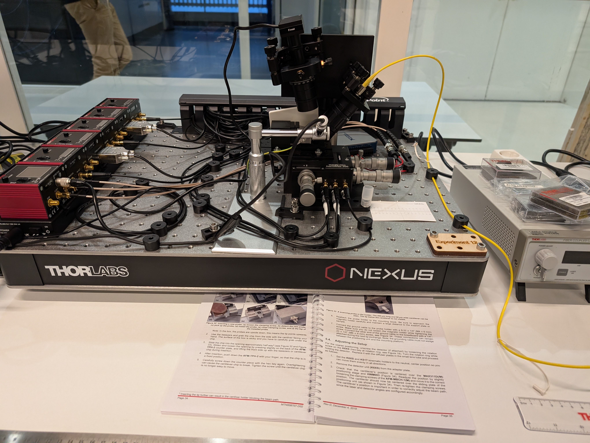

## Inleiding
In de wereld van de qantumfysica draait alles om extreem kleine structuren, zoals atomen, moleculen en nanomaterialen. Om zulke kleine objecten zichtbaar te maken, hebben wetenschappers speciale microscopen nodig. Een van de krachtigste technieken hiervoor is de Atomic Force Microscope (AFM). In dit quantumlab gaan we deze microscoop gebruiken om oppervlakken te bestuderen op nanoschaal.

### De AFM
Een Atomic Force Microscope is een geavanceerd meetinstrument dat werkt met een ultrakleine naald (de 'tip') die over een oppervlak beweegt. De tip bevindt zich aan het uiteinde van een flexibele cantilever. Terwijl de tip het oppervlak scant, worden kleine krachten tussen de tip en het materiaal gemeten. Hierdoor kan de AFM een gedetailleerd beeld maken van het oppervlak, met een resolutie die zo goed is dat we in het uiterste geval zelfs individuele atomen kunnen waarnemen!

Met onze AFM is het mogelijk om bijvoorbeeld de grootte van de putjes in een cd, dvd en zelfs blue ray te meten en te vergelijken. Ook is het mogelijk om biologische droge samples te onderzoeken, zoals keratine van een haar of de facetten van een vliegenoog.

### De AFM-meting
In het kort:
* De tip van de AFM wordt voorzichtig naar het oppervlak gebracht.
* Terwijl de tip het oppervlak scant, buigt de cantilever afhankelijk van de krachten die erop werken.
* Een laser weerkaatst op de cantilever en wordt opgevangen door een detector, die de beweging registreert (en feedback verzorgt aan de beweging).
* Een computer zet deze data om in een gedetailleerde afbeelding van het oppervlak.
Voor de uitgebreide werking: Kijk verder bij *Theorie*.

### Zelf aan de slag
Tijdens dit experiment gaan jullie zelf een AFM gebruiken om een oppervlak op de honderd nanometer nauwkeurig te scannen. Jullie zullen leren hoe je de AFM instelt, een scan uitvoert en de resultaten interpreteert. 
De AFM opent een wereld waarin we letterlijk de bouwstenen van de natuur kunnen zien en begrijpen. Dit is een unieke kans om op een interactieve manier kennis te maken met nanotechnologie en quantumonderzoek. 

## Uitvoering

### Materiaal
1. Verwijder de perspex kap van de opstelling alvorens te starten.
2. Zorg voor een device met de volgende software geïnstalleerd:
* AMCap
* EDU-AFM software, download via Thorlabs.
* NI-DAQmx (deze heeft geen icoon)
3. Zorg ervoor dat je de belangrijkste onderdelen van de AFM kent: 
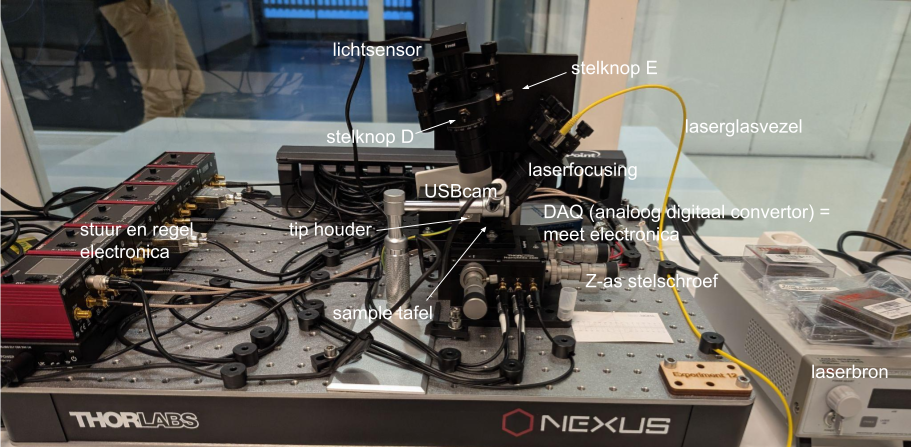

### Opstarten
1. Plug in de USB kabel van de USB-hub en zet de POWER on links onder op de AFM.
2. Start de software: 
    * AMCap voor de webcam en selecteer als nodig bij het tabblad *devices* de USB camera.
    * EDU-AFM en accepteer de hardware instellingen: Druk op OK.
3. Zet de Windows zo neer dat beide tegelijk zichtbaar zijn op je scherm. 

### Sample plaatsen
1. Draai de webcam opzij, weg van de scantafel.
2. Leg het sample met de pincet op de scantafel, met de naald er midden boven.
3. Zet de laser aan door de sleutel een kwartslag te draaien en op enable te drukken. Draai de *power adjust* naar maximaal. De laser moet even opwarmen.
4. In de EDU-AFM software: Zorg dat het rondje net links naast de oorsprong staat. De *X-deflection* moet op *-0,1 V* staan. Dit krijg je voor elkaar door voorzichtig aan stelschroef E (horizontale instelling) en eventueel D (verticale instelling) te draaien.
5. In de EDU-AFM software: Zet de *Z-feedback* op *ON*. 
6. Zet de webcam er vlak voor neer in het zelfde vlak, zodat je van opzij kan zien.  

7. Laat de tip HEEL VOORZICHTIG zakken met de Z-as-grofafstelknop. Kijk terwijl je draait naar het beeld van de webcam. Zie ook foto.  
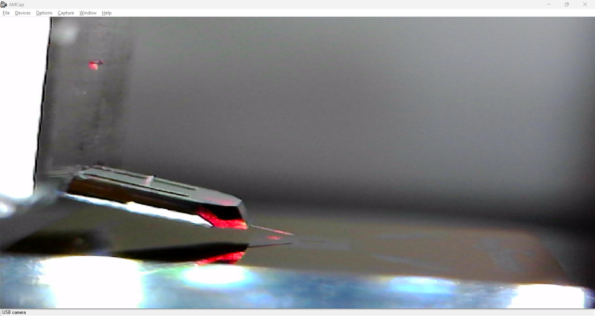
8. Ga op tijd over op de Z-as-fijnafstelknop. 
9. Draai de Z-as-fijnafstelknop totdat de tip het sample raakt. De Z-voltage zie je dan plots zakken. Stel deze in op 25V. 
Wanneer de fijnafstelknop niet verder kan draaien en het sample niet bereikt wordt, draai hem dan helemaal terug en herhaal zo nodig stappen 7 en 8, 
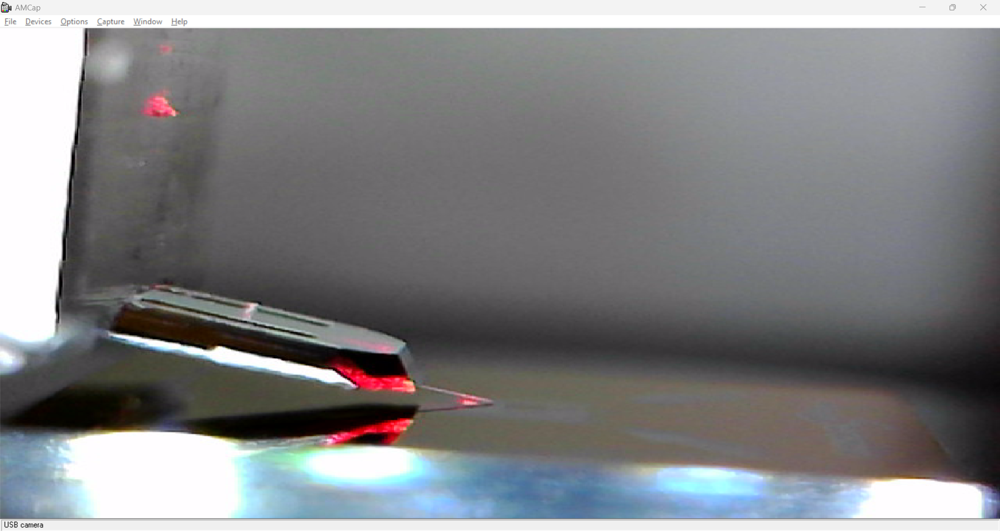  
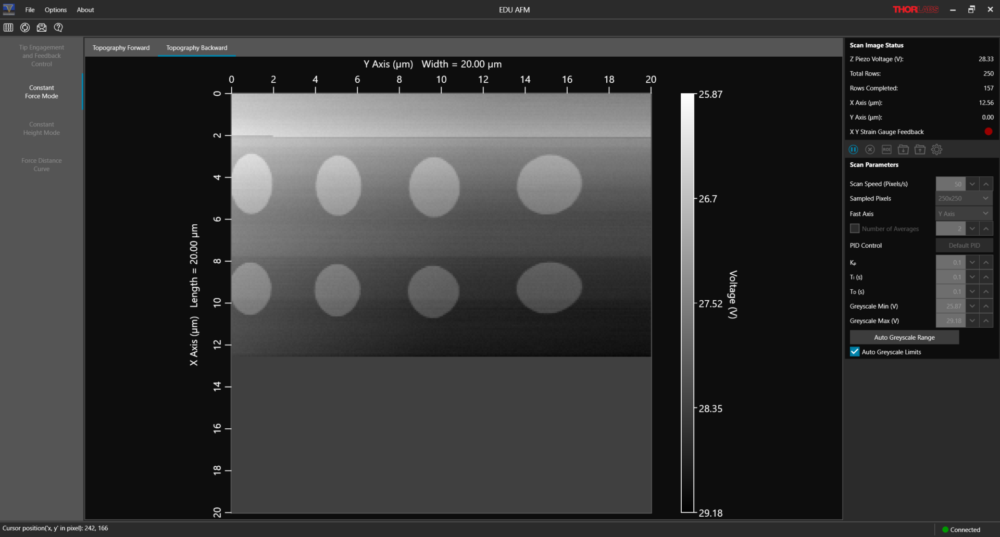
10. Ga naar scannen.

### Scannen
1. Ga naar het tabblad aan de linker kant: Constant Force Feedback. 
2. Stel eventueel de grootte in van je scan bij Sampled Pixels (rechts).
3. Pas eventueel de Scan Speed aan.
4. Druk op het PLAY knopje.
5. Ga even wat anders doen ;). Een typische scan duurt 10 minuten. Deze tijdsduur is uiteraard afhankelijk van de gekozen grootte en scan snelheid.

### Afsluiten of sample wisselen 
1. Stop een eventuele scan.
2. Ga naar het Tip Engagement and Feedback Control tab (links boven).
3. Retract de tip met fijn-afstelknop van de Z-as door deze linksom (tegen de klok in) te draaien (rechts van de tafel de voorste). Je ziet op de webcam de tip omhoog bewegen en je ziet de Z-voltage oplopen tot 50V. Draai de Z-as-fijnafstelknop helemaal terug. 
4. Draai nu de Z-as-grofafstelknop terug (dus linksom - tegen de klok in), tot dat de tip niet verder omhoog beweegt (de laatste slagen zijn dode slagen - die hoeven niet)
5. Druk op de knop laser "enable" op de lasermodule om de laser uit te schakelen.
6. Verwijder het sample met de pincet.  
* Als je echt helemaal wilt stoppen: 
7. Sluit eventueel de laser af door de sleutel een kwartslag te draaien op de lasermodule. 
8. Power off Thorlabs power links onder op de opstelling.

### Sample preparatie
Hier wat algemene tips:
* Sample moet schoon en vlak zijn.
* Spoel met IsoPropylAlcohol en eventueel gedestilleerd water en laat het goed drogen.
* Breng sample aan op speciale sample disk van metaal, of op dekglaasje (minder vlak). 
* Bevestig sample met dubbelzijdige tape of (seconde)lijm.

### Tip vervangen
1. Software en hardware off. Dus ook de Laser!
2. Leg de cd-hoes als tafeltje neer voor het plateau, met de witte kant boven. 
3. Maak de gemagnetiseerde houder los door deze voorzichtig omhoog te draaien. De aarddraad kan hierbij blijven zitten.
4. Leg de houder op z'n kop op de cd hoes.
5. Gebruik 1,5mm inbussleutel om de tip houder losser te draaien, draai maximaal 1 slagje, laat de schroef zitten.
6. Volg verder handleiding pagina 33-34.
7. Daarna verder vanaf punt 8 op pagina 38 t/m 42.
8. Continueer op pagina 68 - 7.3 - place a sample
9. Laser enable en draai naar maximum.
10. Pagina 69, +/- 1,5 V Sum voltage.

(my-label-resultaten)=
## Resultaten en verwerking
1. Sla je scan op. Gebruik als bestandsnaam: *ConstantForce-datum-tijd-naam-GROOTTE-XY-PIXELSZIZE-XY* , zodat de instellingen goed worden vastgelegd.
2. Open de applicatie *Gwyddion* en kies: File - Open - selecteer het .csv-bestand. Klik linksonder op bestandstype: *Raw data files* en open het bestand.
3. Gebruik de instellingen:  
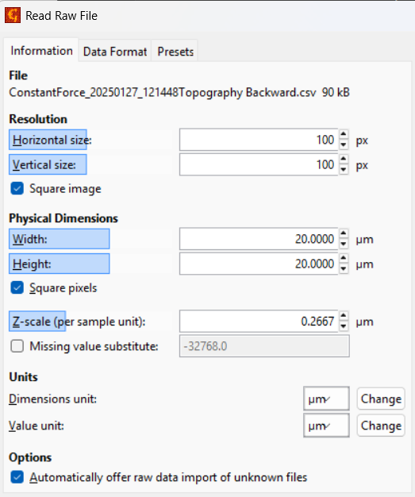 
Zorg dat de instellingen passen bij het genomen sample.
Druk vervolgens op *Execute*. Als het werkt dan zie je nu een preview en kun je op *OK* drukken.
_(Mocht je een foutmelding krijgen in de trant van CSV bestand klopt niet, controleer dit bestand eerst in Excel op het juiste aantal kolommen en rijen. Soms valt er magisch genoeg ééntje weg.)_
3. Op deze wijze kan gemeten worden hoe groot details zijn: *Tools* menu - tweede icoontje: *Measure Distances...*. Klik op een rand van een detail in je opname sleep naar een andere rand om zo de afstand ertussen te meten. Let op: Het window van afstand meten kan verdwijnen achter andere windows. 
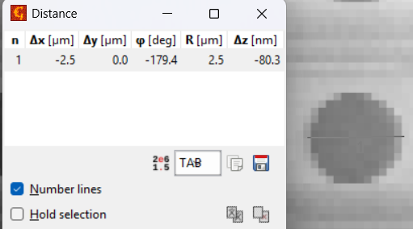 
4. Op deze wijze kan een hoogteprofiel gemaakt worden: *Tools* menu - vierde icoontje: *Extract profiles...*. Klik van begin tot eind waar je een profiel van wilt.  
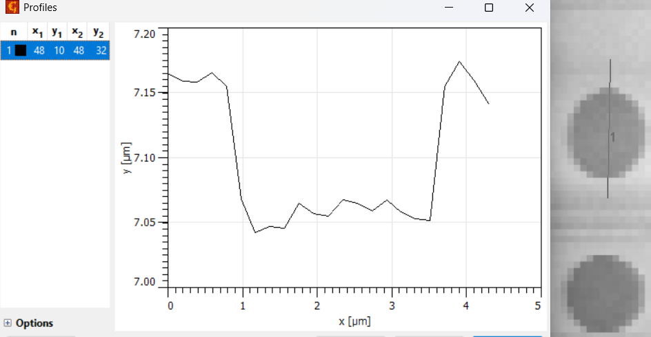 
5. Met het derde icoontje kan een profiel over een X- en Y-as tegelijk worden gemaakt. 
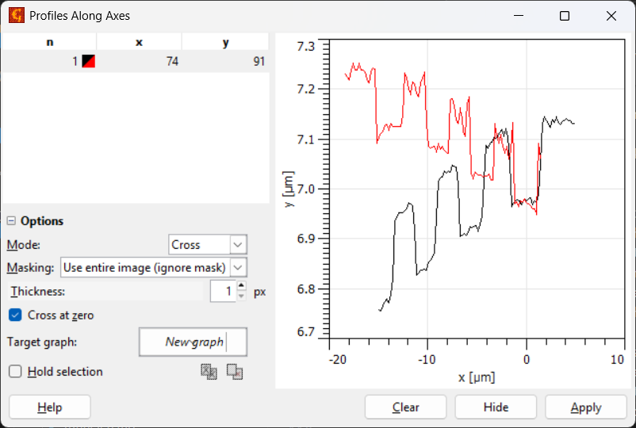 

## Theorie (_under construction_)
### Introductie 
De AFM (Atomic Force Microscope) behoort tot de klasse van de 'scanning probe microscopes'. Deze klasse is ontstaan in het begin van de jaren tachtig van de vorige eeuw toen Binning en Roher de Nobelprijs wonnen met hun scanning tunneling microscope. De AFM is later uitgevonden door Binning, Quate en Gerber. 
 
Een scanning probe microscoop maakt gebruik van een 'probe', of een sonde in het Nederlands. Op deze sonde zit een tip, waarmee de microscoop het oppervlak van het preparaat aftast. Door atomaire krachten wordt deze tip weggeduwd of aangetrokken, waardoor de microscoop heel nauwkeurig de pieken en dalen kan meten van het materiaal. 
 
Deze soort microscopen worden veel gebruikt in de industrie, met name voor kwaliteitscontrole van halfgeleiders en chips, en worden ook veel gebruikt in de biologie, omdat je er cellen mee kunt weergeven zonder ze te beschadigen. 

### De 'sonde' of arm 
We noemen de sonde met de tip ook wel de arm van de AFM. Deze arm is meestal gemaakt van silicium of silicium-nitride. Op de onderkant van de arm zit de tip; zie het plaatje hieronder (gemaakt met een electron microscope). 
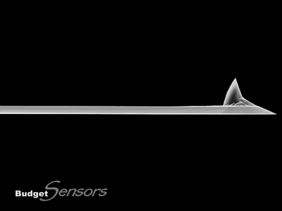 
(Figuur van BudgetSensors.com: https://www.budgetsensors.com/contact-mode-afm-probe-aluminum-contal) 
Deze arm buigt door de atomaire krachten, waardoor er een oppervlaktegrafiek gemaakt kan worden. Deze arm moet aan meerdere voorwaarden voldoen, een daarvan is dat de veerconstante laag moet zijn omdat de atomaire krachten ook zwak zijn. Dit kan berekend worden met behulp van de wet van Hooke: 

$F = −k \cdot z $ 

Hierin staan de volgende grootheden: 

$F$ — De kracht op de arm 
$k$ — De veerconstante van de arm 
$z$ — De afwijking van de normale situatie 

Op de datasheet staat dat de veerconstante 0.2 Nm is, als we aannemen dat de afwijking van de arm 1 µm is, dan is de kracht: 

$F = −k\cdot = 0.2μN $

Oftewel de krachten die uitgeoefend worden op de arm van de AFM zijn erg klein. 

### De interactie tussen het preparaat en de tip 

De interactie tussen het oppervlak en de tip wordt bepaald door twee soorten krachten, die van dichtbij (1 nm) en die van ver weg (1 nm – 100 nm). De krachten die op grotere afstand werken zijn de Van der Waalskracht, elektrostatische kracht en capillaire kracht. Verder speelt de atmosfeer rond het preparaat nog een rol net zoals het materiaal waarvan de arm en tip zijn gemaakt. Hieronder zijn de drie krachten die op lange afstand werken nog kort uitgelegd. 

#### Elektrostatische kracht 

Het kan gebeuren dat de arm van de AFM statisch geladen wordt, hierdoor kan de scan beïnvloed worden of in zijn geheel niet meer werken. 

#### Capillaire krachten 

Als je meet in een normale atmosfeer zit er op ieder materiaal een heel klein laagje water. De tip bereikt dit laagje water voordat het het sample bereikt waardoor er een microscopische druppel ontstaat aan de tip. Door deze druppel is er een extra aantrekkende kracht aan de arm wat de meting beïnvloedt. 

#### Van der Waalskracht 

De laatste kracht die de arm voelt is de Van der Waalskracht wanneer de tip dichtbij (~een paar nm) komt, deze kracht genereert een potentiaal die als volgt beschreven kan worden: 

$U_vdw=\frac{C}{r^6}

Hierin staan de volgende grootheden: 

$U_vdw$ — Het van der Waals potentiaal 
$C$ — Een constante 
$r$ — Afstand 

#### Afstotende kracht  

Naast de drie bovengenoemde krachten ondervindt de arm op hele korte afstand (0.1 nm) ook een afstotende kracht. Deze kracht komt tot stand door de afstotende werking tussen atomen. 

#### Totale kracht 

Als je alle bovengenoemde krachten optelt krijg je het bekende Lennard-Jones potentiaal, deze is te zien in de figuur hieronder. Zoals je kunt zien is de potentiaal afstotend voor hele kleine afstanden (de afstoting tussen atomen) en een aantrekkende kracht op grote afstand (van der Waalskracht en capillaire werking). 

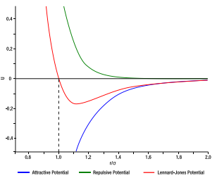 
 (figuur van Feigl, D.: Das Rasterkraftmikroskop im Praktikum, Karlsruher Institut für Technologie,
 state examination paper, 201 en uit Thorlabs manual)

### Scanning methodes 

De AFM heeft twee hoofdmanieren van scannen, de contactmode en de dynamic mode. De AFM hier heeft alleen de zogenaamde contactmodes dus die zullen hier beschreven worden. Contact mode bestaat weer uit twee verschillende methodes, constant force (constante kracht) en constant height (constante hoogte). 

#### Constant Height mode 

Constant height mode is de simpelste methode aangezien de AFM niet hoeft te corrigeren. In deze methode wordt de arm van de AFM op dezelfde hoogte gehouden tijdens het gehele scanproces. Deze methode werkt alleen voor hele gladde preparaten want als het "dal" te diep is verliest de tip contact en is er niks meer te zien met de AFM. 

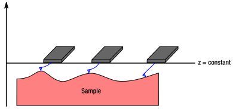 
(figuur van Thorlabs manual)

#### Constant Force Mode 

Constant force mode maakt gebruik van een feedbackmechanisme om de kracht op de arm constant te houden. Hierdoor is de AFM in deze mode beter in staat om het oppervlak te volgen en kan er een grover preparaat gemeten worden. 

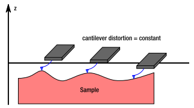 
(figuur van Thorlabs manual)

