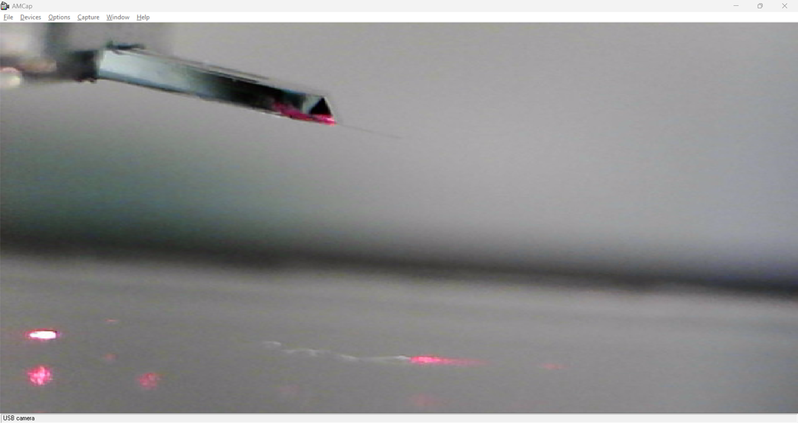

# Atomic Force Microscope
_AFM Practicum handleiding_

## Inleiding
In de wereld van de qantumfysica draait alles om extreem kleine structuren, zoals atomen, moleculen en nanomaterialen. Om zulke kleine objecten zichtbaar te maken, hebben wetenschappers speciale microscopen nodig. Een van de krachtigste technieken hiervoor is de Atomic Force Microscope (AFM). In dit quantumlab gaan we deze microscoop gebruiken om oppervlakken te bestuderen op nanoschaal.

### De AFM
Een Atomic Force Microscope is een geavanceerd meetinstrument dat werkt met een ultrakleine naald (de 'tip') die over een oppervlak beweegt. De tip bevindt zich aan het uiteinde van een flexibele cantilever. Terwijl de tip het oppervlak scant, worden kleine krachten tussen de tip en het materiaal gemeten. Hierdoor kan de AFM een gedetailleerd beeld maken van het oppervlak, met een resolutie die zo goed is dat we in het uiterste geval zelfs individuele atomen kunnen waarnemen!

Met onze AFM is het mogelijk om bijvoorbeeld de grootte van de putjes in een cd, dvd en zelfs blue ray te meten en te vergelijken. Ook is het mogelijk om biologische droge samples te onderzoeken, zoals keratine van een haar of de facetten van een vliegenoog.

### De AFM-meting 
In het kort:
* De tip van de AFM wordt voorzichtig naar het oppervlak gebracht.
* Terwijl de tip het oppervlak scant, buigt de cantilever afhankelijk van de krachten die erop werken.
* Een laser weerkaatst op de cantilever en wordt opgevangen door een detector, die de beweging registreert (en feedback verzorgt aan de beweging).
* Een computer zet deze data om in een gedetailleerde afbeelding van het oppervlak.
Voor de uitgebreide werking: Kijk verder bij *Theorie*.

### Aan de slag

Tijdens dit experiment gaan jullie zelf een AFM gebruiken om een oppervlak op nanoschaal te scannen. Jullie zullen leren hoe je de AFM instelt, een scan uitvoert en de resultaten interpreteert. Misschien ontdekken jullie zelfs structuren die met het blote oog onzichtbaar zijn!
De AFM opent een wereld waarin we letterlijk de bouwstenen van de natuur kunnen zien en begrijpen. Dit is een unieke kans om op een interactieve manier kennis te maken met nanotechnologie en quantumonderzoek.

## Uitvoering

### Materiaal
1. Verwijder de perspex kap van de opstelling alvorens te starten.

2. Zorg voor een device met de volgende software geïnstalleerd:
* AMCap
* EDU-AFM software, download via Thorlabs.
* NI-DAQmx (deze heeft geen icoon)

### Opstarten
1. Plug in de USB kabel van de USB-hub en zet de POWER on links onder op de AFM.
2. Start de software: 
    * AMCap voor de webcam en selecteer als nodig bij het tabblad *devices* de USB camera.
    * EDU-AFM en accepteer de hardware instellingen: Druk op OK.
3. Zet de Windows zo neer dat beide tegelijk zichtbaar zijn op je scherm. 
### Controleren

### Sample plaatsen
1. Draai de webcam opzij, weg van de scantafel.
2. Leg het sample met de pincet op de scantafel, met de naald er midden boven.
3. Zet de laser aan door de sleutel een kwartslag te draaien en op enable te drukken. Draai de *power adjust* naar maximaal. De laser moet even opwarmen.
4. In de EDU-AFM software: Zorg dat het rondje net links naast de oorsprong staat. De *X-deflection* moet op *-0,1 V* staan. Dit krijg je voor elkaar door voorzichtig aan stelschroef E (horizontale instelling) en eventueel D (verticale instelling).
5. In de EDU-AFM software: Zet de *Z-feedback* op *ON*. 
6. Zet de webcam er vlak voor neer in het zelfde vlak, zodat je van opzij kan zien. 

7. Laat de tip HEEL VOORZICHTIG zakken met de Z-as-grofafstelknop. Kijk terwijl je draait naar het beeld van de webcam. Zie ook foto. 

8. Ga op tijd over op de Z-as-fijnafstelknop. 
9. Herhaal 4 en 5, totdat de tip het sample raakt. De Z-voltage zie je dan plots zakken. Stel deze in op 25V.
  

10. Ga naar scannen.

### Scannen
1. Ga naar het tabblad aan de linker kant: Constant Force Feedback. 
2. Stel de grootte in van je scan bij Sampled Pixels (rechts).
3. Pas eventueel de Scan Speed aan.
4. Druk op het PLAY knopje.
5. Ga even wat anders doen ;)

### Afsluiten of sample wisselen 
1. Stop een eventuele scan.
2. Ga naar het Tip Engagement and Feedback Control tab (links boven).
3. Retract de tip met fijn-afstelknop van de Z-as door deze linksom (tegen de klok in) te draaien (rechts van de tafel de voorste). Je ziet op de webcam de tip omhoog bewegen en je ziet de Z-voltage oplopen tot 50V. Draai de Z-as-fijnafstelknop helemaal terug. 
4. Draai nu de Z-as-grofafstelknop terug (dus linksom - tegen de klok in), tot dat de tip niet verder omhoog beweegt (de laatste slagen zijn dode slagen - die hoeven niet)
5. Druk op de knop laser "enable" op de lasermodule om de laser uit te schakelen.
6. Verwijder het sample met de pincet.  
* Als je echt helemaal wilt stoppen: 
7. Sluit eventueel de laser af door de sleutel een kwartslag te draaien op de lasermodule. 
8. Power off Thorlabs power links onder op de opstelling.

### Sample preparatie

### Tip vervangen
1. Software en hardware off. Dus ook de Laser!
2. Leg de cd-hoes als tafeltje neer voor het plateau, met de witte kant boven. 
3. Maak de gemagnetiseerde houder los door deze voorzichtig omhoog te draaien. De aarddraad kan hierbij blijven zitten.
4. Leg de houder op z'n kop op de cd hoes.
5. Gebruik 1,5mm inbussleutel om de tip houder losser te draaien, draai maximaal 1 slagje, laat de schroef zitten.
6. Volg verder handleiding pagina 33-34.
7. Daarna verder vanaf punt 8 op pagina 38 t/m 42.
8. Continueer op pagina 68 - 7.3 - place a sample
9. Laser enable en draai naar maximum.
10. Pagina 69, +/- 1,5 V Sum voltage.

