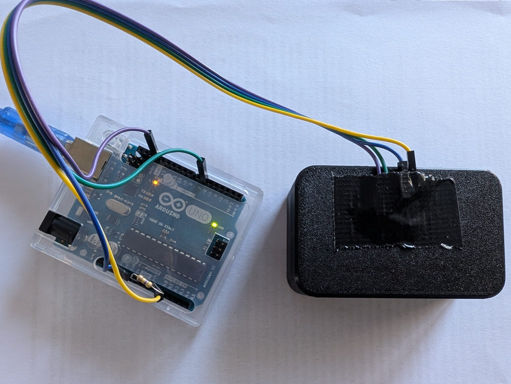
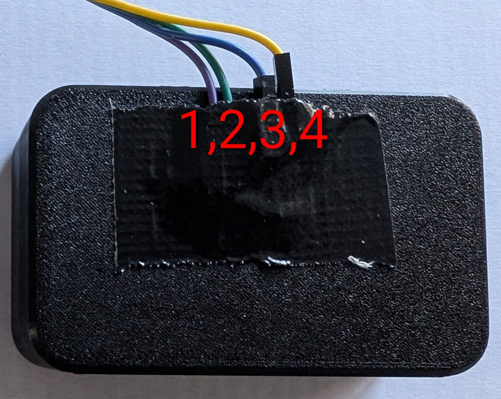

# Fosforescentie vereenvoudigd
practicumhandleiding

```{figure} ./media/fluorescentie-simple/doosje-open.jpeg
    :width: 250
    :name: open_doosje
    :align: center 
```
## Inleiding
In het kort werkt dit experiment als volgt: We plaatsen een fosforescerende materiaal in een doosje en belichten dit met UV licht. Vervolgens meten we met een foto-diode (fototransistor) en een Arduino elke tijdstap (0,2 (s)) de hoeveelheid licht en geven dit weer in een grafiek. Hieruit kunnen we de halfwaardetijd bepalen van het fosforescerende materiaal.
<br>
Bij fosforescentie blijft, in tegenstelling tot bij fluorescentie, een materiaal vrij lang nagloeien. Bij fluorescentie is dit nanosecondes, bij fosforescentie duurt dit millisecondes tot uren. Dit proces is eenvoudig(er) meetbaar. Waarom fosforescentie zoveel langer duurt, heeft te maken met *spin* en is te vinden in de theorie aan het einde.

### Leerdoelen
* De leerling kan het verschil uitleggen tussen fluorescentie en fosforescentie, inclusief het begrip halfwaardetijd.
* De leerling kan beschrijven hoe spin en het Pauli‑uitsluitingsprincipe leiden tot het vertraagde verval bij fosforescentie.
* De leerling kan met behulp van een eenvoudige opstelling met een Arduino meetgegevens verzamelen van een fosforescerend materiaal.
* De leerling kan een vervalcurve analyseren en een exponentiële fit of machtswet-fit uitvoeren.
* De leerling kan uit meetgegevens en fitparameters de halfwaardetijd bepalen en berekenen.
* De leerling kan uitleggen waarom fosforescentie in niet‑ideale kristallen beter beschreven wordt door een machtswet dan door een enkelvoudig exponentieel verval.
* De leerling kan reflecteren op de betrouwbaarheid van verschillende fitmethodes en op de invloed van het begin- en staartgedeelte van de meetcurve.

## Materiaal

<br>

* Doosje (3D geprint), lichtdicht, met in het deksel 4x 1mm gaatje geboord. Download hier de 3D bestanden (STL): {Download}`software<./media/fluorescentie-simple/Small box with hinged lid -aangepast-versie-with-holes.stl>`
* Fototransistor (Kingbright l-53p3c) (korte poot is collector, aangesloten op 5V, lange poot op AO)
* Weerstand 470kOhm (aangesloten op A0 en GND).  (In A0 zitten dus 2 pootjes!).
* UV led (mat, ander uiterlijk dan fototransistor ivm verwarring)
* Dupont jumper cables M-F 20 of 30cm 4 stuks.
* Arduino Uno of Leonardo + case en kabel De Arduino is vooraf geprogrammeerd. De Arduino code is hier eventueel te downloaden. {Download}`software<./media/fluorescentie-simple/ReadVoltageNew.ino>`
* Stukje zwart ducktape
* Fluorescerend materiaal (accufolie??)

**Sluit (zonodig) de 4 kabels van het doosje op de juiste manier aan. Vergeet daarbij niet de weerstand!**

In de tabel staat hoe je de kabels moet aansluiten **van links naar rechts** t.o.v. de voorkant van het doosje (zie foto). **Let niet op de kleuren!**


<br>

| doosje | 1 | 2 | 3 | 4 |
|-----|-----|-----|-----|-----|
| Arduino | GND | 6~ | 5V | A0 |

Het schakelschema staat hieronder. De kleuren van de kabels zijn een voorbeeld - bij je doosje **zijn de kleuren anders!**

```{figure} ./media/fluorescentie-simple/schema-nummer.jpeg
    :width: 700
    :name: schema
    :align: left
```
<br>

```{figure} ./media/fluorescentie-simple/schema.png
    :width: 700
    :name: schema
    :align: left
```


## Meten
Met de link hieronder wordt via javascript code in een webpagina de spanning die de Arduino meet weergegeven. De gemeten spanning is een maat voor de hoeveelheid licht die op de fototransistor valt. 

1) Open het doosje door een beetje op de voorkant van de onderzijde te drukken en tegelijk de bovenkant omhoog te draaien naar achteren.
2) Bekijk de binnenkant: Beneden bevindt zich fosforescerend, zelfklevend papier. Aan de binnenkant van de deksel bevinden zich links een matte UVled en rechts de fototransistor.
3) Sluit het doosje.
4) Sluit de USB poort aan. 
5) Open onderstaande link met een **Chrome** of Edge browser en 
6) Druk op **"Verbinden"** om de verbinding te maken met de Arduino en geef de USB poort toestemming.  
7) De meting begint vanzelf. Als de doos dicht is, is de spanning laag (bijna 0V), als de doos open is dan is de spanning hoog (bijna 5V). Probeer maar.
8) Sluit de doos, stel de meettijd in op 30 seconden en druk op **"UV aan & start meeting"**. De UV lamp in de doos schijnt standaard 5 seconden op het sample. 
9) Na 5 seconden reset de grafiek en meet hij verder en stopt vanzelf aan het einde van de meettijd.
10) Lees de halfwaardetijd op minstens 2 verschillende plaatsen zo nauwkeurig mogelijk af en noteer deze ergens. Bij voorbeeld aan het begin en vanaf 3 seconden oid. Is dit hetzelfde?
11) Druk op de Halfwaardetijd-fit knop. Herken je de functie? De B staat voor achtergrond. Het programma probeert een fit te maken, maar deze is niet erg goed. 
12) Probeer nu met de Handmatige halfwaardecurve knop een betere fit te krijgen:
13) Druk op de Handmatige halfwaardecurve knop en stel met de schuiven de achtergrond in en ook $I_0$. Probeer vervolgens met de laatste schuif de fit zo goed mogelijk passen te krijgen. (Als de grafiek raar zoomt kun je dat herstellen door 2x op de halfwaardetijd-fit knop te drukken).
14) Hoe groot is de best passende halfwaarde tijd? Komt die overeen met de waardes die je vond bij **10**?
15) Zoals je hebt gemerkt is de fit niet geweldig passend. Probeer nu de Machtswet-fit eens...die past perfect! Meer hierover in de theorie. Noteer nu eerst de (fit-)variabelen.
16) Doe nu een een langere meeting, van een minuut of langer: Wat valt je op aan de halfwaardetijd-fit als je de eerste 10 seconden negeert? 
17) Herhaal het experiment eventueel met een andere sample.


<br>
<a href="./media/fluorescentie-simple/measure-versie12.html" target="_blank">Open measuring applet</a>
<br><br>

Als alternatief is het ook mogelijk de html-pagina hieronder te downloaden en vervolgens te openen in een **Chrome** of Edge browser.
{Download}`software<./media/fluorescentie-simple/measure-versie12.html>`

## Opdrachten
Bestudeer de theorie als je dat nog niet gedaan hebt en beantwoord vervolgens de volgende vragen:
1) Bereken met behulp van de theorie de halfwaardetijd van jouw machtswet-fit.
2) Leg uit waarom men normaal gesproken onderzoek doet naar fosforescentie bij temperaturen waarbij stikstof vloeibaar is.
3) Leg uit wat (je denkt dat) er gebeurt met de halfwaardetijd wanneer je je sample eerst heel erg warm maakt voordat je gaat meten.
4) Onderzoek met het simulatiespel onderaan het kansproces en bepaal een aantal maal de (gemiddelde) halfwaarde"tijd" (aantal). 

## Theoretische achtergrond
### Waarom fosforescentie langer duurt dan fluorescentie
Fluorescentie wordt uitgebreid behandeld in de NLT-module **Quantum Ready!**. Hieronder zie je een fluorescentie-energiediagram uit deze module. Een foton brengt een molecuul in de aangeslagen toestand: Het electron komt in een hoger energieniveau. Vervolgens komt er wat energie vrij *Q* via een stralingsvrije overgang. Tenslotte valt het electron terug naar de grondtoestand onder het uitzenden van een foton (met minder energie en dus een andere kleur dan het oorspronkelijke foton). Dit is over het algemeen een proces dat nanosecondes duurt. 

```{figure} ./media/fluorescentie-simple/energiediagram1.png
    :width: 400
    :name: energiediagram
    :align: center 
Uit de NLT-module Quantum Ready
``` 
Bij fosforescentie gebeurt iets vergelijkbaars, echter dit proces duurt milisecondes tot uren. Hieronder staat het energiediagram (ook wel Jablonski diagram genoemd) weergegeven, wat daaronder verder wordt toegelicht. 

```{figure} ./media/fluorescentie/Jablonski.png
    :width: 400
    :name: Jablonski
    :align: center 
By Curtis Mobley, from: https://www.oceanopticsbook.info/view/scattering/level-2/theory-fluorescence-and-phosphorescence
``` 

Een foton brengt een molecuul in de aangeslagen toestand, waarbij een electron in een hoger energie niveau komt. 
Het electron zat in de grondtoestand in gepaarde toestand: Het ene electron had een spin-up, het andere spin-down. Dit noemen we een singlet toestand $S_0$. (Het spin-impulsmoment is hierbij nul). Als het ene electron in een hoger niveau komt, blijft zijn spin behouden/ hetzelfde ($S_1$). Via een intersystem-crossing waarbij wat energie vrij komt, komt het electron in een triplet toestand $T_1$ terecht, maar dan is de spin van het electron geflipt! (Het kostte wat energie om he te flippen, maar die kwam vrij). Wanneer het electron nu wil terugkeren naar de grondtoestand $S_0$ is er een probleem: Hij heeft dezelfde spin als het oorspronkelijk gepaarde electron. Dit is in strijd is met het *Pauli‑uitsluitingsprincipe*. We noemen dit daarom een **verboden overgang**. Het electron moet wachten tot het voldoende energie heeft om de spinflip te maken, voordat het kan terugvallen naar de grondtoestand $S_0$. (Deze energie kan niet uit een foton komen, maar komt uit de spin-baan koppeling.) Dit "wachten" op de spinflip zorgt ervoor dat fluorescentie zolang kan bestaan.

### Waarom welk verband
Het terugvallen van aangeslagen elektronen en daarbij het vrijkomen van fotonen is een kansproces. We verwachten daarom een afnemend exponentieel verband, waarbij 50% van de fotonen is teruggevallen bij de fosforescentie-halfwaardetijd van het molecuul. 
Echter materiaal eigenschappen van het molecuul zorgen ervoor dat niet alle elektronen een even grote kans hebben. 
In een fosforescerende halfgeleider zoals wij dat hebben kunnen de elektronen in twee banden zitten: De *valentieband* (grondtoestand) met de *gaten* en de *geleidingsband* (aangeslagen-toestand) met de aangeslagen, ontsnapte elektronen (een *gat* is een ontbrekend elektron in een rooster). Het aantal gaten voor elektronen om naar terug te vallen is beperkt. Dit zorgt ervoor dat de eerste elektronen meer kans hebben op een plekje dan de latere elektronen. Hieruit volgt een verval volgens een (tweede orde) machtswet in plaats van een exponentiële functie. Dit wordt onderaan wiskundig toegelicht, net als een simulatiespel van deze twee banden.  
Daarnaast zitten de aangeslagen elektronen in zogenaamde energy-"traps" (vallen) van verschillende diepte. In een perfect molecuul/kristalrooster hebben alle traps dezelfde diepte en zijn er oneindig veel gaten, wat leidt tot exponentieel verval. Maar in de dit geval zorgen traps van verschillende diepte voor een (ontelbare) optelsom van exponentiële functies: De machtswet. Het laatste deel (de staart) van de machtswet komt overeen met de staart van de halfwaardetijd-fit. De staart en daarmee de gevonden halfwaardetijd van de halfwaardetijd-fit geeft (ook) informatie over hoelang de fosforescentie "doorwerkt".
De combinatie van deze fysische factoren zorgt voor een model als hieronder, waarbij de b in de praktijk kan variëren tussen de 0,2 en 2. 

### Rekenen met de machtswet
Uit de machtswet $I(t) = \frac{a}{(t + t_0)^b}$ is vrij eenvoudig de halfwaardetijd te berekenen: 
<br>
We zoeken het tijdstip $t_{1/2}$ waarop $I(t) = \frac{1}{2} I_0$.
<br>
Op t=0 geldt:
<br>
$I_0 = I(0) = \frac{a}{(0 + t_0)^b} = \frac{a}{t_0^b}$
<br>
dus op tijdstip $t=t_{1/2}$ geldt: 
<br>
$I(t) = \frac{1}{2} I_0 = \frac{1}{2}\frac{a}{t_0^b} = \frac{a}{(t + t_0)^b}$
<br>
wegstrepen a en omdraaien of kruislings-vermenigvuldigen levert:
<br>
$2t_0^b = (t+t_0)^b$
<br>
links en rechts de b-macht wortel nemen:
<br>
$2^{1/b}\cdot t_0 = t+t_0$
<br>
dus:
<br> 
$t = 2^{1/b}\cdot t_0 - t_0$ 
<br>
en netter:
<br>
$t = t_0(2^{1/b}-1)$
<br>

Bijvoorbeeld als je de volgende waarden hebt gevonden: $t_0 = 0.253$ en $b = 0.718$, dan geldt:
<br>
 $t_{1/2} = 0.253 \cdot (2^{1/0.718} - 1) = 0.41 s$.
<br><br>
Je kunt nu zelf narekenen dat voor het tijdstip dat je bijvoorbeeld 1% over hebt, geldt:
% Afleiding van de vervaltijd t_x voor een Power Law

% De basisformule voor intensiteit
%$I(t) = \frac{a}{(t + t_0)^b}

% Stap 1: De beginintensiteit bepalen (t = 0)
%$I_0 = I(0) = \frac{a}{(0 + t_0)^b} = \frac{a}{t_0^b}$

% Stap 2: De conditie voor fractie x opstellen
%$\frac{a}{(t_x + t_0)^b} = x \cdot \frac{a}{t_0^b}$

% Stap 3: De constante a elimineren en de vergelijking omdraaien
%$(t_x + t_0)^b = \frac{t_0^b}{x}$

% Stap 4: De macht b isoleren door te verheffen tot de macht 1/b
%$t_x + t_0 = \left( \frac{t_0^b}{x} \right)^{1/b}$

% Stap 5: Vereenvoudigen en t_x oplossen
%$t_x + t_0 = t_0 \cdot \left( \frac{1}{x} \right)^{1/b}$
%$t_x = t_0 \cdot \left( \frac{1}{x} \right)^{1/b} - t_0$

% Stap 6: De definitieve formule (buiten haakjes halen)
%$t_x = t_0 \cdot \left( \left[ \frac{1}{x} \right]^{1/b} - 1 \right)$

$t_{1\%} = 0,253 \cdot \left( \left[ \frac{1}{0,01} \right]^{1/0,718} - 1 \right) = 153 \text{ s}$

<br>
Wil je de halfwaardetijd uit de machtswet laten berekenen door de computer, gebruik dan deze applet:
<br>
<a href="./media/fluorescentie-simple/halfwaardetijd.html" target="_blank">Open calculating applet</a>
<br><br>

### Simulatiespel van het fosforescentie verval model
In de link is een simulatiespel te vinden met als doel het kansproces te demonstreren dat achter het fosforescentie verval model zit (de zogenaamde tweede orde kinetiek).
<br>
<a href="./media/fluorescentie-simple/spel_perfect.html" target="_blank">open spel</a>
<a href="./media/fluorescentie-simple/spel_perfect2.html" target="_blank">open spel versie2</a>
<br><br>
#### Speluitleg
* Er zijn 30 aangeslagen elektronen en 30 gaten om naar terug te keren.
* Er wordt gegooid met twee 30 kantige dobbelstenen: De ene dobbelsteen definieert het precieze aangeslagen elektron dat mag recombineren met een gat (bijvoorbeeld het 12e elektron mag vertrekken). De andere dobbelsteen definieert het gat waarnaar het elektron mag terugkeren (bijvoorbeeld het 28e gat). Aan beide voorwaarden moet voldaan worden voor een geslaagde recombinatie. 
* Druk op "Gooi" en je kunt handmatig gooien.
* Druk op "Auto" en de computer gooit voor jou.
* Druk op "Stop Auto" als "Auto" te lang doorgaat.
* Druk op "Machtswetfit" om een (eerste orde) machtswet te fitten. 
(Bij een eerste orde machtswet van aantal, hoort een tweede orde machtswet van intensiteit - denk aan: Activiteit is de afgeleide van het aantal deeltjes in de tijd.)

### Wiskundige afleiding van de (tweede orde) machtswet (moet nog ge-edit)
De afleiding van de machtswet uit de kansberekening van het spelmodel gaat als volgt: Eerst wordt de kans per worp bepaald. Aan de hand daarvan stellen we een functie op (een differentiaalvergelijking). Door deze functie te integreren verkrijgen we de oplossing hiervan en kunnen deze schrijven in een machtwet vorm.
1. De kans per worp bepalen
Uitgangspunt is dat In het model met $S=30$ vakjes voor zowel rij H als rij L, wordt de kans op een succesvolle verplaatsing bepaald door twee onafhankelijke voorwaarden:
De overgangskans ($\wp$) dat een munt van rij H naar rij L verhuist tijdens één worp (tijdstap), is het product van twee afzonderlijke kansen:
Kans op het kiezen van een bezet vakje in H: De rode dobbelsteen moet een vakje kiezen waar een munt ligt. Omdat er $n_H$ elektronen zijn op een totaal van $N_H = 30$ vakjes, is deze kans: $P(H) = \frac{n_H}{N_H}$
Kans op het kiezen van een leeg vakje in L: De witte dobbelsteen moet een vakje kiezen in de onderste rij dat nog leeg is. Het aantal lege vakjes in L is gelijk aan $N_L - n_L$. Omdat alle elektronen die uit H verdwijnen in L terechtkomen, geldt $n_L = N_H - n_H$. Hierdoor is het aantal lege plekken in L gelijk aan $N_L - (N_H - n_H)$. Gezien $N_H = N_L = S = 30$, versimpelt dit tot exact $n_H$ lege plekken. De kans op een leeg vakje is dus: $P(\bar{L}) = \frac{n_H}{N_L}$
De totale overgangskans per tijdstap $t$ is:
$\wp(H \to L) = P(H) \cdot P(\bar{L}) = \frac{n_H}{S} \cdot \frac{n_H}{S} = \left( \frac{n_H}{S} \right)^2$
2. De differentiaalvergelijking (Tweede-orde kinetiek)
In de continue limiet stellen we de verandering van het aantal elektronen per tijdseenheid (de emissiesnelheid) gelijk aan deze kans:$-\frac{dn_H}{dt} = k \cdot n_H^2$. 
Hierbij is $k$ een constante die in dit model gelijk is aan $\frac{1}{S^2}$. Dit type vergelijking staat bekend als tweede-orde kinetiek.
3. Integratie naar de machtswet
Om $n_H(t)$ te vinden, integreren we de vergelijking:
Scheid de variabelen: $\frac{dn_H}{n_H^2} = -k \, dt$.
Integreer beide zijden: $\int \frac{1}{n_H^2} dn_H = \int -k \, dt$.
Dit geeft de lineaire relatie voor het omgekeerde aantal elektronen: 
$\frac{1}{n_H(t)} - \frac{1}{n_H(0)} = kt$
Als we dit omschrijven naar $n_H(t)$, krijgen we de formule voor het verval van het aantal elektronen, 
$n_H(t) = \frac{n_H(0)}{1 + n_H(0)kt}$. Dit kan worden herschreven in de standaardvorm van een inverse machtswet: $n_H(t) = \frac{\alpha}{t + t_0}$.

4. Herschrijven naar de machtswet-vorm
Om de formule te krijgen in de juiste vorm, isoleren we $n_H(t)$ via de volgende algebraïsche stappen: 
Isoleer $1/n_H(t)$:$\frac{1}{n_H(t)} = kt + \frac{1}{n_H(0)}$
Breng de rechterkant onder één noemer:$\frac{1}{n_H(t)} = \frac{kt \cdot n_H(0) + 1}{n_H(0)}$
Inverteer de breuk om $n_H(t)$ te vinden:$n_H(t) = \frac{n_H(0)}{n_H(0)kt + 1}$
Deel teller en noemer door $n_H(0)k$ om de vorm $(t + t_0)$ in de noemer te krijgen:
$n_H(t) = \frac{1/k}{t + \frac{1}{n_H(0)k}}$

5. Intensiteit van het licht
De gemeten lichtintensiteit $I(t)$ is evenredig met de snelheid van het verval ($-\frac{dn_H}{dt}$). Omdat de intensiteit afhankelijk is van $n_H^2$, volgt voor de intensiteit de machtswet:
$I(t) \propto \frac{1}{(t + t_0)^2}$. In experimenten met echte materialen zoals ZnS:Cu (koper-geactiveerd zinksulfide) varieert de exponent van deze machtswet vaak tussen de 1 en 2, afhankelijk van de complexiteit van de energievallen in het materiaal.


## Bronnen
1) Quantum Ready! NLT module voor havo en vwo 2025, door R. Ockhorst en L. Koopman.
2) James Lincoln; Phosphorescence as an exponential decay. Phys. Teach. 1 March 2021; 59 (3): 220–221. https://doi.org/10.1119/10.0003675
3) Tsai, C. Y., Lin, J. W., Huang, Y. P., & Huang, Y. C. (2014). Modeling and assessment of long afterglow decay curves. TheScientificWorldJournal, 2014, 102524. https://doi.org/10.1155/2014/102524
4) George C. Lisensky, Manish N. Patel, and Megan L. Reich. Experiments with Glow-in-the-Dark Toys: Kinetics of Doped ZnS Phosphorescence. Journal of Chemical Education 1996 73 (11), 1048. https://doi.org/10.1021/ed073p1048
5) Malgieri, M., Rosi, T., Onorato, P., & Oss, S. (2018). Looking at phosphorescence with a smartphone, explaining phosphorescence with a dice toy model. Physics Education, 53(6), Artikel 065016. https://doi.org/10.1088/1361-6552/aaddf1

