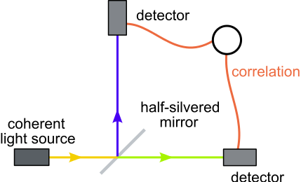
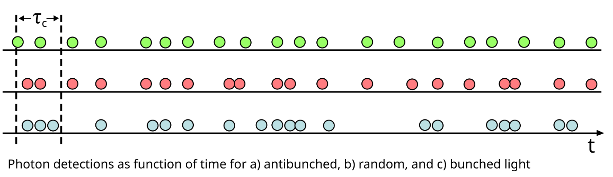
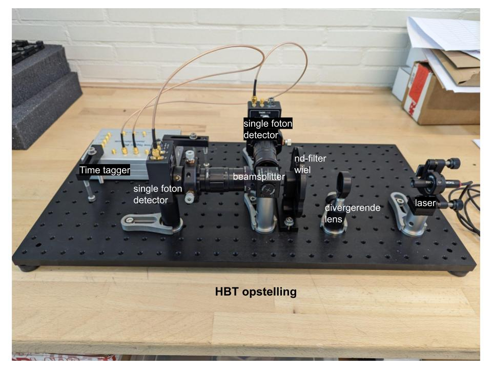
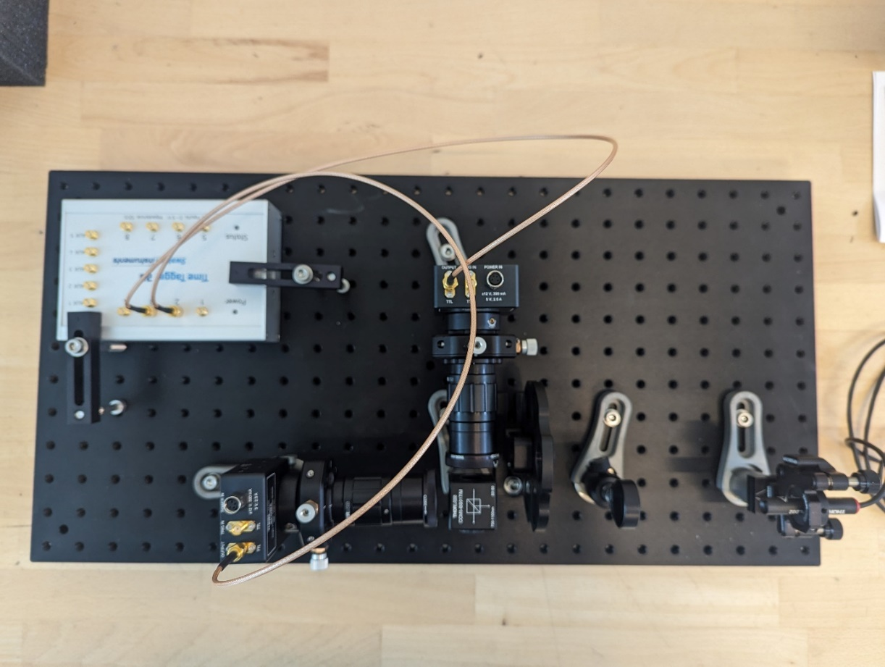
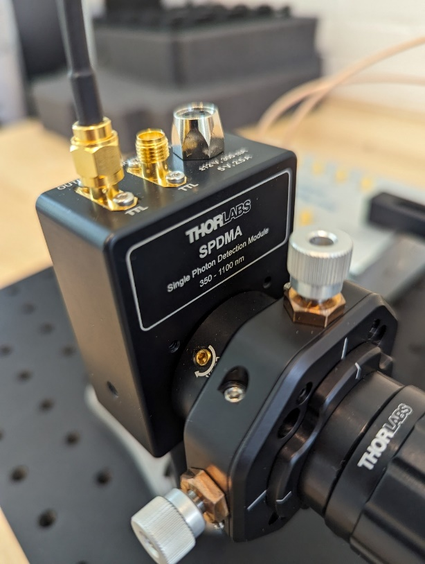
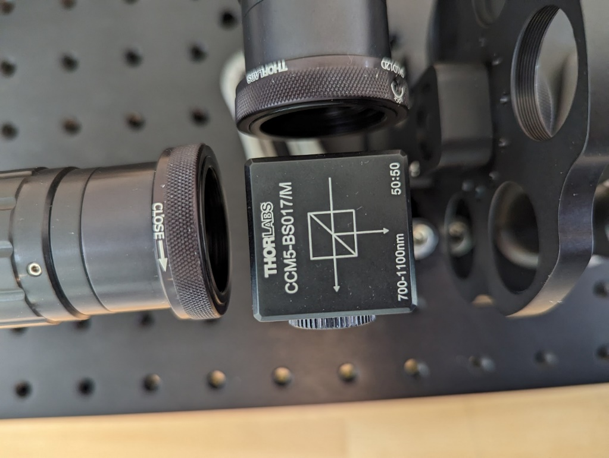
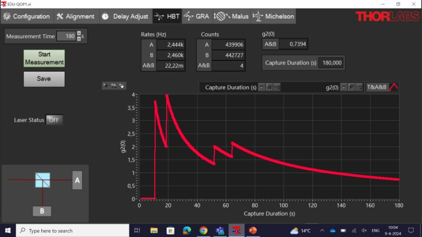

# Hanbury - Brown and Twiss 
(HBT) - practicumhandleiding

## Inleiding

Wanneer een straal licht wordt gesplitst in twee richtingen en
vervolgens gedetecteerd, dan verwacht je, als de afstand precies gelijk
is, dat de ze gelijktijdig aankomen bij de detectoren. Als je echter
gaat kijken naar enkele fotonen *(single photons)*, dan kan het niet
anders dat het ene foton bij de ene detector wordt gemeten en de andere
bij de andere.

## Doel

In dit experiment wordt onderzocht in hoeverre laserlicht bestaat uit
losse fotonen.

## Theorie

Met het Hanbury-Brown and Twiss experiment kan de correlatie tussen
fotonen worden bepaald en daarmee de quantisatie van licht worden
aangetoond.

Het experiment bestaat uit:

- Licht bron,

- Halfdoorlatende spiegel of beamsplitter, die het licht precies 50%
  doorlaat en 50% weerkaatst onder een hoek van 90°.

- Foton detectoren (2)

- Een manier om de correlatie te meten tussen de binnenkomende fotonen.

Zie hieronder voor een schematische tekening van het experiment.



Bron:
https://commons.wikimedia.org/wiki/File:Correlation-interferometer.svg

**Meer theorie – De tweede order correlatie functie en het
HBT-experiment**

De tweede orde correlatiefunctie $ g^{(2)}(t) $ speelt een centrale
rol in het Hanbury Brown en Twiss (HBT) -experiment en helpt bij het
begrijpen van de kwantummechanische eigenschappen van licht en andere
deeltjes. Het experiment werd oorspronkelijk uitgevoerd om de coherentie
en statistieken van fotonen te bestuderen, en heeft implicaties voor de
interpretatie van klassiek en quantumlicht.

### Het HBT-experiment

Het HBT-experiment werd in de jaren 1950 uitgevoerd door Robert Hanbury
Brown en Richard Twiss. Het doel was om de grootte van sterren te meten
aan de hand van het licht dat van de sterren afkomstig is. Ze gebruikten
hiervoor een techniek gebaseerd op intensiteitsinterferometrie, waarbij
de correlatie tussen de intensiteit van het licht op twee verschillende
detectoren werd gemeten.

### De tweede orde correlatiefunctie $ g^{(2)}(t) $ 

De tweede orde correlatiefunctie $ g^{(2)}(t) $ beschrijft de
waarschijnlijkheid om op twee verschillende momenten of op twee
verschillende plekken een foton te detecteren. Het is een maat voor de
correlatie tussen de intensiteit van het licht op twee detectoren. Voor
fotonen wordt dit vaak gebruikt om de statistische eigenschappen van een
lichtbron te bestuderen, zoals:

- Coherent licht (zoals laserlicht),

- Incoherent of thermisch licht (zoals licht van een gloeilamp of
  sterren),

- Quantum licht (zoals uitgezonden door enkele, losse fotonen bronnen).

De functie is gedefinieerd als:
```{math}
:label: 1
g^{(2)}(t) = \frac{\left\langle I\left( t_{0} \right)I\left( t_{0} + t \right) \right\rangle\,}{\left\langle I\left( t_{0} \right) \right\rangle^{2}}

```
waarbij $I(t)$ de intensiteit van het licht is op tijdstip $(t)$ en
de hoekhaken $\left\langle \right\rangle$ gemiddelde waarden
aangeven.

De intensiteiten $I\left( t_{0} \right)$ en
$I\left( t_{0} + t \right)$ in de correlatiefunctie staan voor de
gemeten intensiteit op twee verschillende tijdstippen. De intensiteit
kan worden gezien als het aantal fotonen dat in een korte tijdsperiode
door de detector wordt waargenomen, of meer algemeen, het vermogen dat
door de detector wordt ontvangen per oppervlakte-eenheid.

Dus voor twee verschillende detectoren, die respectievelijk een
intensiteit $I_{1}$ en $I_{2}$ meten, zou de correlatiefunctie als
volgt kunnen worden uitgedrukt:

```{math}
:label: 2
g^{(2)}(t) = \frac{\left\langle I_{1}\left( t_{0} \right)I_{2}\left( t_{0} + t \right) \right\rangle\,}{\left\langle I_{1}\left( t_{0} \right) \right\rangle\left\langle I_{2}\left( t_{0} + t \right) \right\rangle}
```

Hierbij worden de gemeten intensiteiten op twee verschillende momenten
(of posities) gecorreleerd en vergeleken met de *verwachte waarden* van
de intensiteiten op zichzelf.

Hierbij kan *t* een kleine tijdsvertraging zijn waarbinnen je meet. Er
wordt getracht *t* zo klein mogelijk te houden, deze is afhankelijk van
de snelheid van de detector en de verwerking van de data.

- Als *t=0*, meet je de gelijktijdige correlatie tussen de twee
  detectoren. Dit betekent dat je kijkt naar hoe vaak beide detectoren
  tegelijk een foton detecteren.

- Als *t≠0*, introduceer je een tijdsvertraging tussen de twee metingen
  en kijk je hoe de waarschijnlijkheid verandert om een foton op
  verschillende tijdstippen op de twee detectoren te detecteren.

Omdat bovenstaande formule niet erg intuïtief en praktisch is, leiden we een praktischer verband af:
Hiertoe moeten we de correlatiefunctie in termen van de intensiteiten (die fotonfluxen zijn) omzetten naar een praktische vorm waarin we het aantal coïncidenties meten. Dit vereist een aantal aannames over de relatie tussen de intensiteit en het aantal fotonen dat gedetecteerd wordt.

Laten we de stappen doorlopen:

In de formule hierboven is $I_1(t)$ de intensiteit van detector 1 op tijd $t$ en $I_2(t)$ de intensiteit van detector 2 op tijd $t + \Delta t$. De gemiddelde intensiteiten zijn de gemiddelde fotonfluxen van de detectoren:

- $\langle I_1(t_0) \rangle$ is de gemiddelde fotonflux in detector 1.
- $\langle I_2(t_0 + t) \rangle$ is de gemiddelde fotonflux in detector 2.

De intensiteit $I(t)$ is in wezen het aantal fotonen per tijdseenheid, en het gemiddelde geeft het gemiddelde aantal fotonen per tijdseenheid over een langere periode.
De intensiteit $I(t)$ is gerelateerd aan het aantal fotonen dat door de detector wordt gedetecteerd. Als we in plaats van de intensiteit het aantal gemeten fotonen willen gebruiken, moeten we de intensiteit $I(t)$ vermenigvuldigen met de meettijd $\Delta t$. Dit levert het aantal gemeten fotonen $N(t)$ over de tijdsperiode $\Delta t$:

- Het aantal gemeten fotonen in detector 1 over de tijdsperiode $\Delta t$ is $N_1 = I_1(t_0) \cdot \Delta t$.
- Het aantal gemeten fotonen in detector 2 over de tijdsperiode $\Delta t$ is $N_2 = I_2(t_0 + t) \cdot \Delta t$.

We kunnen nu het aantal gemeten fotonen vergelijken in plaats van de intensiteiten.

Nu, in plaats van de intensiteit te vergelijken, willen we het aantal coïncidenties meten. Een coïncidentie wordt gedefinieerd als een gebeurtenis waarbij beide detectoren een foton detecteren binnen een bepaalde tijdsvertraging $\Delta t$. Dus het aantal coïncidenties $N_{\text{coinc.}}$ is het aantal keren dat beide detectoren tegelijkertijd (binnen een tijdsvertraging) een foton detecteren.

De verwachte waarde van het aantal coïncidenties wordt gegeven door:

$
N_{\text{coinc.}} = \left\langle I_1(t_0) \cdot I_2(t_0 + t) \right\rangle \cdot \Delta t
$

Als we dit nu combineren krijgen we: 
$$
g^{(2)}(t) = \frac{\left\langle I_1(t_0) I_2(t_0 + t) \right\rangle\cdot \Delta t}{\left\langle I_1(t_0)\cdot \Delta t \right\rangle \left\langle I_2(t_0 + t)\cdot \Delta t \right\rangle} = \frac{}
$$


Als we het aantal coïncidenties in termen van de verwachte intensiteit willen uitdrukken, gebruiken we de gemiddelde intensiteiten (fotonsnelheden) van de detectoren, wat het verwachte aantal coïncidenties oplevert:

$$
N_{\text{verwacht}} = \frac{N_A \cdot N_B}{T} \cdot \Delta t
$$

Waarbij:
- \(N_A\) het totale aantal fotonen gemeten door detector A is.
- \(N_B\) het totale aantal fotonen gemeten door detector B is.
- \(T\) de totale meettijd is.
- \(\Delta t\) de tijdsvertraging is.

De praktische correlatiefunctie is de ratio van het werkelijke aantal coïncidenties tot het verwachte aantal coïncidenties. Dit geeft ons de tweede formule:

$$
g^{(2)}(t) = \frac{N_{\text{coinc.}}}{N_{\text{verwacht}}} = \frac{N_{A \& B}}{\left( \frac{N_A \cdot N_B}{T} \right) \cdot \Delta t}
$$


gebruik van dit verband:

```{math}
:label: 3
\mathbf{\,}\mathbf{g}^{\left( \mathbf{2} \right)}\left( \mathbf{t} \right)\mathbf{=}\frac{\mathbf{aantal\, coïncidenties}}{\mathbf{verwacht\, aantal\, coïncidenties\,}}\mathbf{=}\frac{\mathbf{N}_{\mathbf{A\& B}}}{\mathbf{N}_{\mathbf{verwacht}}}

```

Een coïncidentie is een gelijktijdige gebeurtenis of een gebeurtenis
binnen de tijdsvertraging, in andere woorden: Dat een foton gelijktijdig
wordt gemeten bij detector A en B.

Het verwachte aantal coïncidenties kan als volgt worden berekend:

```{math}
:label: 4
\mathbf{N}_{\mathbf{verwacht}}\mathbf{=}\left( \frac{\mathbf{N}_{\mathbf{A\,}}\mathbf{\cdot}\mathbf{N}_{\mathbf{B}}\mathbf{\,}}{\mathbf{T}} \right)\mathbf{\cdot}\mathbf{\Delta}\mathbf{t}

```
Waarin $N_{A}$ en $N_{B}$ het totaal aantal gemeten fotonen is in
detector A en B, $T$ de totale meettijd is, en $\Delta t$ de
tijdsvertraging is.

### Betekenis van de waarde van $g^{(2)}(t)$

1\. $g^{(2)}(0) = 1$: Dit betekent dat er geen correlatie is tussen
de fotonen op verschillende momenten of detectoren. Dit komt
bijvoorbeeld voor bij coherent licht zoals dat van een ideale laser,
waarbij de fotonen een ***Poissonverdeling*** volgen.

2\. $g^{(2)}(0) < 1$: Dit wordt geassocieerd met antibunching, wat
betekent dat fotonen de neiging hebben om niet tegelijkertijd
gedetecteerd te worden. Dit is een kenmerk van quantumlicht zoals dat
van een enkele, losse fotonenbron. In dit geval is de waarschijnlijkheid
om twee fotonen tegelijk te detecteren lager dan de kans om
afzonderlijke fotonen te detecteren.

3\. $g^{(2)}(0) > 1$: Dit wijst op bunching, waarbij fotonen de
neiging hebben om samen te komen. Dit komt vaak voor bij incoherent of
thermisch licht (bijvoorbeeld licht van een gloeilamp), waarbij fotonen
de neiging hebben om in groepen te komen. De waarschijnlijkheid om twee
fotonen tegelijk te detecteren is hoger dan verwacht op basis van
onafhankelijkheid.

4\. $g^{(2)}(grote\, t) \rightarrow 1$: Wanneer de tijdsvertraging
*t* groot is, wordt de correlatie kleiner en convergeren alle bronnen
naar $g^{(2)}(t) = 1$, wat betekent dat er geen correlatie meer is
tussen de fotonen op zeer verschillende tijdstippen.

$\rightarrow$ Waarom is dat denk je?

### Toepassingen van het HBT-experiment

In het originele HBT-experiment werd deze correlatiefunctie gebruikt om
aan te tonen dat fotonen van thermische bronnen (zoals sterren) bunching
vertonen, d.w.z. dat fotonen vaker tegelijk worden gedetecteerd dan
toevallig zou gebeuren. Dit bevestigde dat licht van thermische bronnen
niet gelijkmatig verdeeld is in tijd, maar eerder in "groepen" komt.

Ook met klassieke golfoptica kan dit gedrag worden verklaard aan de hand
van het samenkomen van golven van incoherente bronnen.

In moderne quantumoptica wordt $g^{(2)}(t)$ veel gebruikt om te
testen of een lichtbron losse, enkele fotonen uitzendt (antibunching) of
klassiek licht uitzendt (coherent of incoherent licht). Bijvoorbeeld,
voor een enkele fotonenbron geldt $g^{(2)}(0) = 0$ , wat betekent
dat de kans om twee fotonen tegelijkertijd te detecteren exact nul is.

Met klassieke golfoptica is dit verschijnsel niet te verklaren, hiervoor
werkt alleen een quantumverklaring.



In de afbeelding is het verschil te zien tussen *g<sup>2</sup>(t) \< 1*
(groen), *g<sup>2</sup>(t) = 1 (rood), g<sup>2</sup>(t) \> 1 (blauw),
waarbij geldt t = de afgebeelde* $\tau$*.*

Afbeelding by Ajbura - Vectorised version of File:Photon bunching.png,
CC BY-SA 4.0, <https://commons.wikimedia.org/w/index.php?curid=73299604>

## Materiaal

Ons experiment bestaat uit:

- Laserdiode

- ND-filter wiel - ND filter (neutral density – grijsfilter), filtert
  als een zonnebril de intensiteit van het laserlicht met instelbare
  factoren tot een minimale transmissie van 10<sup>-4</sup>.

- Beamsplitter

- Single foton detectoren (2 stuks)

- Time-tagger, die van elk gedetecteerd foton de tijd labelt.

- Software om de Time-tagger uit te lezen.

Foto’s
opstelling:





In bovenstaande foto’s is te zien:

1.  Opstelling met zij- en

2.  Bovenaanzicht (met linksboven de timetagger)

3.  Een single photon detector

4.  De beamsplitter met rechtsdaarvan het ND-filter wiel

PS: De voedingen zijn hierbij niet aangesloten, ook ontbreekt de
behuizing voor complete verduistering.

## Uitvoering

### Veiligheid

Let bij de uitvoering op de veiligheid: Van laserlicht kun je blijvend
blind raken. Ondanks dat deze laser is geselecteerd om mee te werken
zonder extra veiligheidsmaatregelen wordt er toch geacht rekening te
houden met de standaard afspraken wanneer je werkt met laserlicht:

- Zorg dat je nooit rechtstreeks in de laser kijkt of anderen in het
  gezicht schijnt.

- Kijk ook uit met strooi- of gereflecteerd licht.

- De laser wordt dan ook niet gedemonteerd.

### De uitvoering in stappen:

1.  Stel het filter wiel in. (Start met 6 is zwakste, vervolgens 1, 2,3,
    4, 5 sterkste.)

2.  Controleer de opstelling.

3.  Sluit de verduisterende behuizing.

4.  Schakel de voedingen aan van de laser en detectoren.

5.  Sluit de USB aan.

6.  Start de Thorlabs software op (EDU-QOP1.vi) - negeer de foutmelding
    betreffende de KLD101 laser controller (die hebben we niet).

7.  Selecteer het HBT tabblad.

8.  Selecteer de gewenste Measurement Time linksboven (kies om te testen
    de standaard 60 seconden).

9.  Start Measurement (Pop up “Please switch on the laser” – zet de
    laser handmatig aan met het knopje op de USB connector bij het
    stopcontact, het lampje zal gaan knipperen en vervolgens gaan
    branden. De “Laser Satus” in de software zal “OFF” blijven.)

10. Maak een screenshot (windowstoets+shift+s).

11. Noteer het aantal gemeten coïncidenties, het aantal counts bij
    detector A en bij B en de berekende waarde voor *g<sup>2</sup>(0)*.

12. Maak nu een meetplan naar gelang hoeveel tijd je hebt voor dit
    experiment. Met filter 6 en 1 heb je relatief snel data, bij de
    andere filters duurt het veel langer omdat deze veel meer
    absorberen. Het doel kan zijn te onderzoeken of laserlicht uit
    enkele, losse fotonen bestaat of niet. Je kunt ook het laserlicht
    vergelijken met incoherent licht.

13. Voer dit meetplan uit.

***Opmerkingen: Zet voor het openen de sensoren en laser uit met de knop van het stekkerblok. De sensoren zijn zeer gevoelig voor te veel licht. Het
filter moet dan ook ten-allen-tijde voor de laser blijven staan als deze aanstaat, anders gaan de heel dure sensors kapot...***



Afbeelding: Screenshot van een meting

## Resultaten

Controleer van minstens één meting de door de software berekende waarde
van *g<sup>2</sup>(0)* door deze waarde zelf uit te rekenen met formules
{eq}`3` en {eq}`4`.
De tijdsvertraging van deze meetapparatuur is 5 ns. Noteer
je berekening en vergelijk je uitkomst.

 
## Conclusie & Evaluatie

Geef hieronder je conclusies met betrekking tot de uitkomsten (de
resultaten) en het doel van de proef. Kun je antwoord geven op de volgende vragen?

- Kun je nu de vorm van de grafieken van je screenshots verklaren? 
    * Hoe kan *g<sup>2</sup>(0) = 4* zijn?

- Wat gebeurt er als je veel langer meet?

- Wat kun je zeggen over de nauwkeurigheid van de opstelling en dus de gevonden resultaten?
    * Zijn 4 coïncidenties ook echt 4 coïncidenties of is dit een meetfout, omdat geldt $t=/0$ ?
    * 


## Ideeën en bronnen:

### Experiment: Tellen van Geiger-Müller-pulsen als Poisson-proces

### Doel
1. Het aantonen van een Poisson-verdeling in een natuurlijk proces: het aantal gemeten ionisaties door een Geiger-Müller-teller.
2. Een analogie leggen met het gedrag van fotonen in het HBT-experiment.

### Benodigdheden
1. Een Geiger-Müller-teller (bijvoorbeeld een betaalbare educatieve GM-teller).
2. Een stabiele stralingsbron (bijvoorbeeld een zwak radioactief element zoals een americiumbron uit een rookmelder, indien toegestaan, of natuurlijke achtergrondstraling).
3. Een computer met een timer en datalogging (bijvoorbeeld via een Arduino of rechtstreeks met de GM-teller als deze USB-output heeft).
4. Software voor analyse (Excel of Python).

### Werkwijze

#### 1. Gegevens verzamelen
1. Plaats de Geiger-Müller-teller in een omgeving met stabiele achtergrondstraling of nabij een bekende zwakke stralingsbron.
2. Stel een vast tijdsinterval in, bijvoorbeeld 1 seconde.
3. Tel het aantal pulsen (events) per tijdsinterval gedurende een langere meetperiode (bijvoorbeeld 10 minuten of langer).

#### 2. Data analyseren
1. Maak een histogram van het aantal gemeten pulsen per tijdsinterval.
2. Bereken de gemiddelde waarde $\lambda$ en de standaardafwijking $\sqrt{\lambda}$.
3. Vergelijk de gemeten verdeling met de theoretische Poisson-verdeling:
$
P(k; \lambda) = \frac{\lambda^k e^{-\lambda}}{k!}
$

#### 3. Optionele uitbreiding: Tijdscorrelaties
- Meet de tijd tussen opeenvolgende pulsen (de inter-arrivaltijden).
- Maak een histogram van deze tijden en onderzoek of ze een exponentiële verdeling volgen, zoals verwacht voor een Poisson-proces.


### Analogietrekking met het HBT-experiment
1. Poissonverdeling van pulsen:
   - Net zoals de GM-teller ionisaties willekeurig registreert, registreert een detector in het HBT-experiment fotonen. Als de lichtbron coherent is (zoals een laser), vertonen de fotonen een vergelijkbaar willekeurig patroon.
   
2. Correlaties:
   - In het HBT-experiment worden gelijktijdige detecties (coïncidenties) onderzocht. Bij een coherente lichtbron zou je ongecorreleerde statistieken verwachten, terwijl bij quantumgecorreleerde of juist thermische lichtbronnen hiervan afwijken.

### Conclusie
Dit experiment toont aan dat het aantal ionisaties in een GM-teller een Poisson-verdeling volgt. De leerlingen kunnen deze resultaten relateren aan het HBT-experiment door te begrijpen hoe willekeurige en gecorreleerde gebeurtenissen fundamenteel verschillen. Dit biedt een toegankelijke manier om statistiek en natuurkundige principes te combineren!

## Voorbeeld onderzoeksvragen PWS:

Hoe werkt een laser?

Wat is een Poissonverdeling en gedraagt laserlicht zo?

Is laserlicht een quantumlichtbron? En bestaat licht uit losse fotonen?

Gebruik hierbij de volgende video:

<div style="display: flex; justify-content: center;">
<div style="position: relative; width: 70%; height: 0; padding-bottom: 56.25%;">
<iframe width="560" height="315" src="https://www.youtube.com/embed/NVqT2Gbrvxs?si=kqeIX7P6uh7-dniM" title="YouTube video player" frameborder="0" allow="accelerometer; autoplay; clipboard-write; encrypted-media; gyroscope; picture-in-picture; web-share" referrerpolicy="strict-origin-when-cross-origin" allowfullscreen></iframe>
</div>
</div>

In deze video wordt de oorspronkelijke tweede orde correlatiefunctie met
de intensiteitsvariabelen uitgelegd (formule 1):

<https://youtu.be/gE-gji46qEc?si=zOEEoTLkuUOsBFYm>

Er zijn ook **documenten** beschikbaar met meer uitleg en achtergrond informatie.

