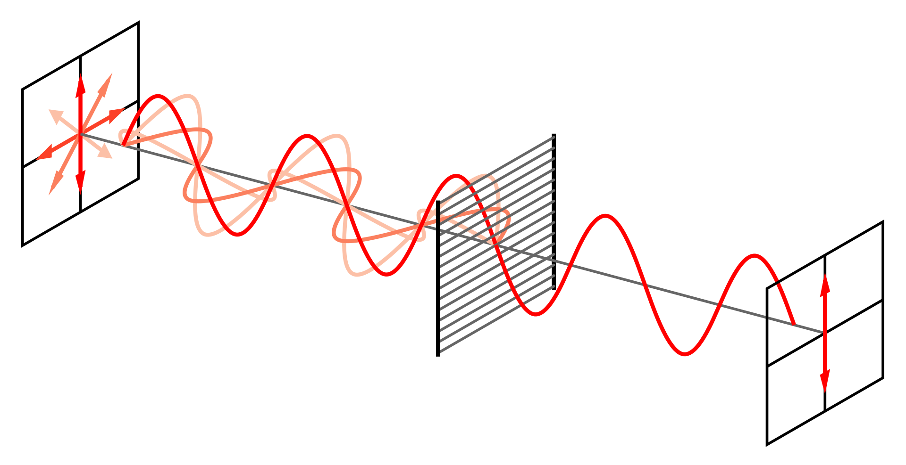
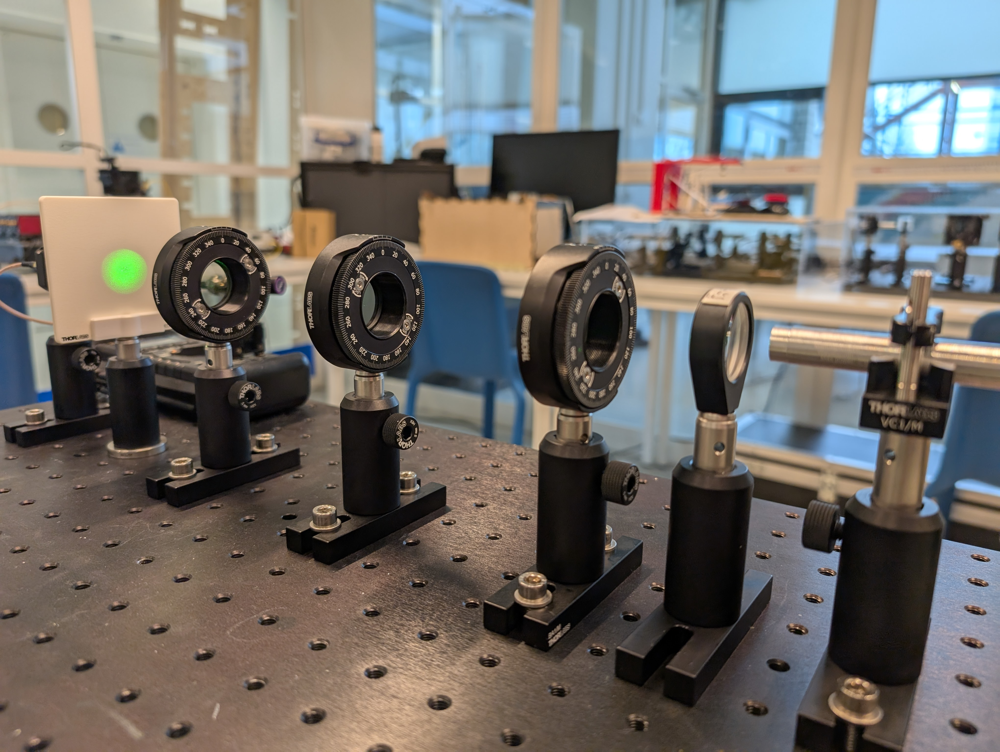
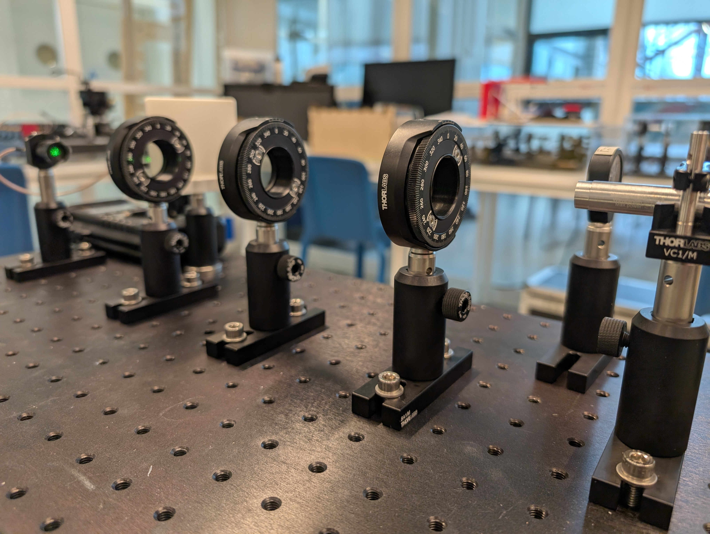
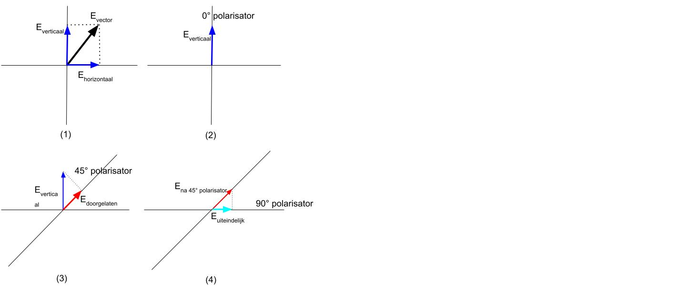

# Wet van Malus
_dit experiment is nog in ontwikkeling_
In dit experiment wordt de wet van Malus met behulp van polarisatoren experimenteel bepaald.
Tevens wordt het begrip superpositie aan de hand van polarisatie onderzocht.

## Doel
Bepaal het verband waarmee de intensiteit van gepolariseerd licht door een polarisator afhangt van de hoek tussen de polarisatierichting van het licht en de transmissie-as van de polarisator.

## Theorie
Elektromagnetische golven zoals licht bestaan uit een elektrische- en magnetische veld-componenten, die loodrecht ten opzichte van elkaar staan. Bij normaal, diffuus, licht heeft het (elektrisch) veld van de golf een willekeurige richting of oriëntatie. 
We kunnen licht echter ook polariseren, waarbij het elektrisch veld van alle golven in dezelfde richting is georiënteerd en dus in maar één richting trilt. We noemen dit lineair gepolariseerd licht. (Er bestaat ook circulair of elliptische polarisatie.) 
Door een lineair polarisatie filter te gebruiken, wordt maar 50% van het licht doorgelaten. Immers, van willekeurig licht heeft maar 50% een elektrisch veld dat georiënteerd is in, bijvoorbeeld, de verticale richting.  <br>
Hieronder is een elektromagnetische golf te zien die door een verticale polarizer gaat. 
<br>

<a href="http://creativecommons.org/licenses/by-sa/3.0/" title="Creative Commons Attribution-Share Alike 3.0">CC BY-SA 3.0</a>, <a href="https://commons.wikimedia.org/w/index.php?curid=724493">Link</a>

<br>
Wanneer na de verticale polarizer een horizontale polarizer wordt toegevoegd, wordt al het licht geabsorbeerd en wordt er geen licht meer doorgelaten.

De wet van Malus geeft aan wat de intensiteit is van het licht als licht een bepaalde hoek ten opzichte van een transmissie as (doorlatingsrichting) van een polarisator maakt. Dit wordt weergegeven in de volgende formule:

```{math}
:label: 0
I = I_0\cos^2(\theta)
```
​waarbij $𝐼_0$ de maximale intensiteit is en 𝜃 de hoek tussen de transmissie-assen van de polarisatoren.

## Materiaal
1. Lichtbron met bundel die goed rechtdoor gaat (laser).
2. Holle lens (-75dpt), om de lichtbundel een groteren diameter te geven.
3. Drie polarisatoren met een instelbare rotatiehoek. Alle drie met een lineaire polarisator.
4. Scherm om het goed zichtbaar te maken.
5. Optische detector: Voor het meten van de intensiteit van het doorgelaten licht.
6. Multimeter om de spanning van de detector te meten

## Uitvoering
>### Veiligheid
>Let bij de uitvoering op de veiligheid: Van laserlicht kun je blijvend
>blind raken. Ondanks dat deze laser is geselecteerd om mee te werken
>zonder extra veiligheidsmaatregelen wordt er toch geacht rekening te
>houden met de standaard afspraken wanneer je werkt met laserlicht:
>
>- Zorg dat je nooit rechtstreeks in de laser kijkt of anderen in het gezicht schijnt.
>- Kijk ook uit met strooi- of gereflecteerd licht.
>- De laser wordt dan ook niet gedemonteerd.

### deel 1 met scherm
1. Zorg dat het scherm en de lens in de bundel op hun plek staan (zie foto).
2. Zet de laser aan. 
3. Zorg dat alle polarisatoren op 0 graden staan: Dat betekent dat er alleen verticaal gepolariseerd licht wordt doorgelaten. Je kunt aan de ribbeltjes met duim en wijsvinger, met je hand erboven, draaien. (alleen de tweede en derde polarisator zijn instelbaar)
4. Er zal een duidelijke lichtbundel zichtbaar zijn op het scherm.

5. Draai nu aan de derde polarisator, degene het dichtst bij het scherm, en zet deze op 90 graden (horizontaal gepolariseerd). Je kunt aan de ribbeltjes met duim en wijsvinger, met je hand erboven, draaien. 
6. Er is nu als het goed is geen licht zichtbaar op het scherm. 
7. Draai nu de middelste polarizer naar 45 graden. 
8. Kijk naar het scherm, wat zie je gebeuren?
9. Kun je dit verklaren? Aan het einde van dit experiment wordt duidelijker hoe dit kan.

### deel 2 met sensor
1. Verwijder nu het scherm uit de opstelling, door deze weg te schuiven. Laat de lens staan (in tegenstelling tot de foto).

2. Zorg dat alle polarisatoren op 0 graden staan.
3. Maak een tabel met daarin een kolom voor de hoek in graden en een kolom voor de sensorspanning in mV.
4. Meet nu, door de derde polarisator te verdraaien, in stapjes van 10 graden van 0 tot 180 graden de doorgelaten intensiteit met de optische detector (de sensorspanning). 

## Resultaten
1. Breid de tabel uit met een kolom voor de theoretische waarde met behulp van de formule uit de theorie. 

|hoek (graden) | cos^2 (doe de hoek in radialen) |	gemeten spanning (mV)	| theoretisch waarde |
|-------------|----------------|-------------|----------------|
|0|1|jouw data|berekend|
2. Maak een grafiek (spreidingsdiagram) van je data en van de theoretische waarde. Let op: de functie $=\cos()$ is in radialen in een spreadsheet. Zet de hoek in graden langs de horizontale as.
3. Voeg een extra grafiek toe van $I$ uitgezet tegen $\cos^2(\theta)$. $I$ dus verticaal.
4. Wat is hier de betekenis van de helling (richtingscoëfficiënt)? Je kunt een (lineaire) trendlijn maken van de helling door op een meetpunt te klikken. Zorg ervoor dat de vergelijking of functie in beeld komt. Wat is het hellingsgetal?

## Conclusie deel 2
Toon aan dat hieruit volgt:
$ I = I_0\cos^2(\theta)$

##  deel 3: Superpositie experiment
We keren terug naar de beginsituatie waarin de lens en het scherm in de opstelling staan. 
1. Plaats deze dus terug.
2. Draai nu aan de derde polarisator, degene het dichtst bij het scherm, en zet deze op 90 graden (horizontaal gepolariseerd). Je kunt aan de ribbeltjes met duim en wijsvinger, met je hand erboven, draaien. 
3. Er is nu als het goed is geen licht zichtbaar op het scherm.
4. Draai nu de middelste polarizer naar 45 graden. 
5. Nu is er wel licht zichtbaar op het scherm.

## Uitleg
### 1. Wat gebeurt er normaal met twee polarisatoren?
Als je twee polarisatiefilters achter elkaar zet met een hoek van **90°** tussen hun polarisatierichtingen, dan blokkeert de tweede (analyzer) al het licht. Dit komt omdat:
- De eerste polarisator laat alleen licht door in zijn polarisatierichting.
- De tweede polarisator is 90° gedraaid, waardoor het geen component van het reeds gepolariseerde licht doorlaat.
Dit betekent dat er geen licht wordt doorgelaten. 

### 2. Wat gebeurt er met drie polarisatoren?
Als je nu een **derde** polarisator **tussen** de eerste twee plaatst, maar gedraaid onder een hoek van **45°**, gebeurt iets vreemds: **er komt weer licht door de laatste polarisator!**  

#### klassieke elektromagnetische golfbenadering (E-vector)



1. Elke lichtgolf heeft een Elektrische veld vector, die bestaat uit een horizontale en verticale component met een bepaalde grootte (afhankelijk van de oriëntatie t.o.v. de horizon).
2. Eerste polarisator (0°): Laat alleen licht door dat in de 0°-richting trilt.
3. Tweede polarisator (45°): Dit absorbeert een deel van het licht, maar het licht dat het wél doorlaat wordt opnieuw gepolariseerd in de 45°-richting.
4. Derde polarisator (90°): Normaal zou deze geen licht doorlaten (zoals bij twee polarisatoren), maar nu wél! Dit komt doordat het licht van de tussenliggende polarisator een component heeft in de 90°-richting.

#### Wiskundige uitleg
- **Eerste polarisator (0°)**  
  - Alleen de verticale component van het licht blijft over.
  - $ E_1 = E_0 \), \( I_1 = I_0 $.

- **Tweede polarisator (45°)**  
  - De verticale golf wordt gedeeltelijk doorgelaten. De nieuwe $ \mathbf{E} $-vector maakt een hoek van 45°.
  - $ E_2 = E_1 \cos(45^\circ) = \frac{E_1}{\sqrt{2}} $. En omdat geldt: $I \propto E^2$, is:
  - $ I_2 = I_1 \cos^2(45^\circ) = \frac{I_1}{2} $.

- **Derde polarisator (90°)**  
  - Nu is het licht al in een 45°-superpositie. De polarisator selecteert de horizontale component van deze golf.
  - $ E_3 = E_2 \cos(45^\circ) = \frac{E_2}{\sqrt{2}} $.
  - $ I_3 = I_2 \cos^2(45^\circ) = \frac{I_2}{2} = \frac{I_0}{4} $.

Er blijft dus **25% van de oorspronkelijke intensiteit** over, terwijl je zonder de tweede polarisator **0%** had gehad!

#### **Met de quantummechanische benadering: Superpositie van fotonen**  

Licht bestaat uit **fotonen**. Wanneer een foton een polarisator passeert, wordt het in een **quantummechanische superpositie** van toestanden gezet.

**Wat gebeurt er bij drie polarisatoren?**  

- **Eerste polarisator (0°)**  
  - Een inkomend foton wordt gemeten in de **verticale** (V) basis.
  - Als het foton oorspronkelijk ongepolariseerd was, is er **50% kans** dat het wordt geabsorbeerd en **50% kans dat het doorgaat**. 
  - De fotonen die doorgaan, zijn nu in de toestand $|V\rangle $.

- **Tweede polarisator (45°)**  
  - Een foton in $|V\rangle $ kan in de **45° basis** als superpositie geschreven worden:  
    $
    |V\rangle = \frac{1}{\sqrt{2}}(|45^\circ\rangle + |-45^\circ\rangle)
    $
  - Wanneer het foton door de 45°-polarisator gaat, wordt het gemeten in de **45°-basis**, en blijft er een **50% kans** over dat het doorgaat.
  - De doorgelaten fotonen zitten nu in de toestand $ |45^\circ\rangle $.

- **Derde polarisator (90°)**  
  - In de **90°-basis** schrijven we de 45°-toestand als:
    $
    |45^\circ\rangle = \frac{1}{\sqrt{2}}(|V\rangle + |H\rangle)
    $
  - De kans dat het foton nu wordt doorgelaten (als $ |H\rangle $) is opnieuw **50%**.
  - Dit betekent dat **25% van de oorspronkelijke fotonen doorgaat**.

#### **Samengevat**
| Benadering   | Wat gebeurt er? |
|-------------|----------------|
| **Klassiek (E-vectoren)** | De tussenliggende polarisator draait de veldvector stapsgewijs, waardoor er een component in de eindrichting blijft. |
| **Kwantummechanisch (fotonen)** | Het foton wordt bij elke polarisator in een nieuwe superpositie gezet. Hierdoor kan het foton doorgaan waar het normaal geblokkeerd zou worden. De tussenliggende polarisator introduceert een nieuwe meetbasis waardoor er licht kan passeren, terwijl zonder deze polarisator het licht volledig zou worden geabsorbeerd. |

## Conclusie deel 3
Dit experiment toont aan dat het invoegen van een derde polarisator onder een hoek een niet-intuïtieve invloed kan hebben op de doorgelaten intensiteit, wat verklaard kan worden zowel klassiek door golfoptica als door het quantummechanische principe van superpositie.
