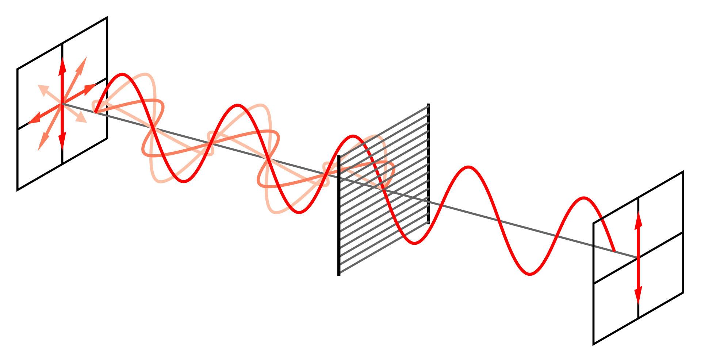
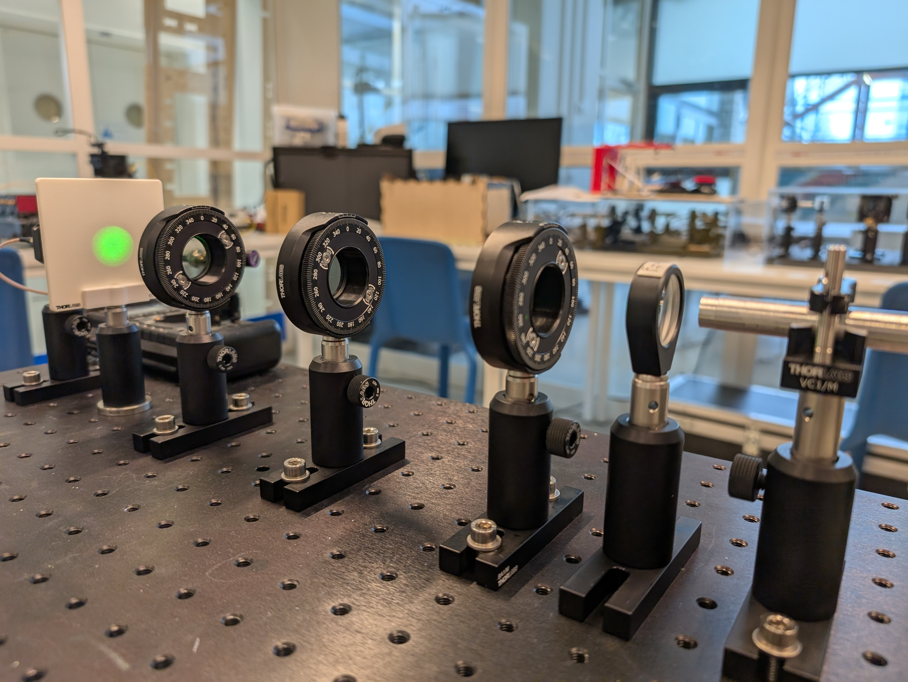
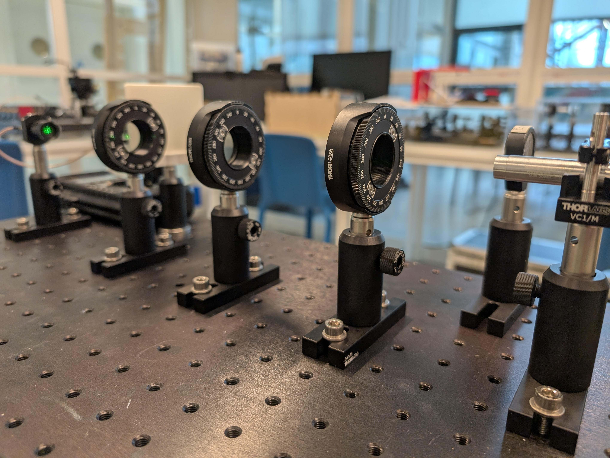
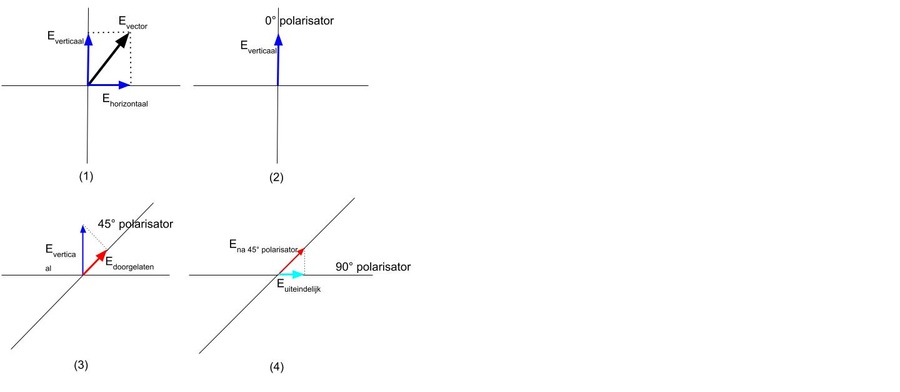

# Wet van Malus
In dit experiment wordt de wet van Malus met behulp van polarisatoren experimenteel bepaald.
Tevens wordt het begrip superpositie aan de hand van polarisatie onderzocht.

## Doel
Bepaal het verband waarmee de intensiteit van gepolariseerd licht door een polarisator afhangt van de hoek tussen de polarisatierichting van het licht en de transmissie-as van de polarisator.

## Theorie
Elektromagnetische golven zoals licht bestaan uit een elektrische- en magnetische veld-componenten, die loodrecht ten opzichte van elkaar staan. Bij normaal, diffuus, licht heeft het (elektrisch) veld van de golf een willekeurige richting of oriëntatie. 
We kunnen licht echter ook polariseren, waarbij het elektrisch veld van alle golven in dezelfde richting is georiënteerd en dus in maar één richting trilt. We noemen dit lineair gepolariseerd licht. (Er bestaat ook circulair of elliptische polarisatie.) 
Door een lineair polarisatie filter te gebruiken, wordt maar 50% van het licht doorgelaten. Immers, van willekeurig licht heeft maar 50% een elektrisch veld dat georiënteerd is in, bijvoorbeeld, de verticale richting.  <br>
Hieronder is een elektromagnetische golf te zien die door een verticale polarizer gaat. 
<br>

<a href="http://creativecommons.org/licenses/by-sa/3.0/" title="Creative Commons Attribution-Share Alike 3.0">CC BY-SA 3.0</a>, <a href="https://commons.wikimedia.org/w/index.php?curid=724493">Link</a>

<br>
Wanneer na de verticale polarizer een horizontale polarizer wordt toegevoegd, wordt al het licht geabsorbeerd en wordt er geen licht meer doorgelaten.

De wet van Malus geeft aan wat de intensiteit is van het licht als licht een bepaalde hoek ten opzichte van een transmissie as (doorlatingsrichting) van een polarisator maakt. Dit wordt weergegeven in de volgende formule:

```{math}
:label: 0
I = I_0\cos^2(\theta)
```
​waarbij $𝐼_0$ de maximale intensiteit is en 𝜃 de hoek tussen de transmissie-assen van de polarisatoren.

## Materiaal
1. Lichtbron met bundel die goed rechtdoor gaat (laser).
2. Holle lens (-75dpt), om de lichtbundel een groteren diameter te geven.
3. Drie polarisatoren met een instelbare rotatiehoek. Alle drie met een lineaire polarisator.
4. Scherm om het goed zichtbaar te maken.
5. Optische detector: Voor het meten van de intensiteit van het doorgelaten licht.
6. Multimeter om de spanning van de detector te meten

## Uitvoering
>### Veiligheid
>Let bij de uitvoering op de veiligheid: Van laserlicht kun je blijvend
>blind raken. Ondanks dat deze laser is geselecteerd om mee te werken
>zonder extra veiligheidsmaatregelen wordt er toch geacht rekening te
>houden met de standaard afspraken wanneer je werkt met laserlicht:
>
>- Zorg dat je nooit rechtstreeks in de laser kijkt of anderen in het gezicht schijnt.
>- Kijk ook uit met strooi- of gereflecteerd licht.
>- De laser wordt dan ook niet gedemonteerd.

### deel 1 met scherm
1. Zorg dat het scherm en de lens in de bundel op hun plek staan (zie foto).
2. Zet de laser aan. 
3. Zorg dat alle polarisatoren op 0 graden staan: Dat betekent dat er alleen verticaal gepolariseerd licht wordt doorgelaten. Je kunt aan de ribbeltjes met duim en wijsvinger, met je hand erboven, draaien. (alleen de tweede en derde polarisator zijn instelbaar)
4. Er zal een duidelijke lichtbundel zichtbaar zijn op het scherm.

5. Draai nu aan de derde polarisator, degene het dichtst bij het scherm, en zet deze op 90 graden (horizontaal gepolariseerd). Je kunt aan de ribbeltjes met duim en wijsvinger, met je hand erboven, draaien. 
6. Er is nu als het goed is geen licht zichtbaar op het scherm. 
7. Draai nu de middelste polarizer naar 45 graden. 
8. Kijk naar het scherm, wat zie je gebeuren?
9. Kun je dit verklaren? Aan het einde van dit experiment wordt duidelijker hoe dit kan.

### deel 2 met sensor
1. Verwijder nu het scherm uit de opstelling, door deze weg te schuiven. Laat de lens staan (in tegenstelling tot de foto).

2. Zorg dat alle polarisatoren op 0 graden staan.
3. Maak een tabel met daarin een kolom voor de hoek in graden en een kolom voor de sensorspanning in mV.
4. Meet nu, door de derde polarisator te verdraaien, in stapjes van 10 graden van 0 tot 180 graden de doorgelaten intensiteit met de optische detector (de sensorspanning). 

## Resultaten
1. Breid de tabel uit met een kolom voor de theoretische waarde met behulp van de formule uit de theorie. 

|hoek (graden) | cos^2 (doe de hoek in radialen) |	gemeten spanning (mV)	| theoretisch waarde |
|-------------|----------------|-------------|----------------|
|0|1|jouw data|berekend|
2. Maak een grafiek (spreidingsdiagram) van je data en van de theoretische waarde. Let op: de functie $=\cos()$ is in radialen in een spreadsheet. Zet de hoek in graden langs de horizontale as.
3. Voeg een extra grafiek toe van $I$ uitgezet tegen $\cos^2(\theta)$. $I$ dus verticaal.
4. Wat is hier de betekenis van de helling (richtingscoëfficiënt)? Je kunt een (lineaire) trendlijn maken van de helling door op een meetpunt te klikken. Zorg ervoor dat de vergelijking of functie in beeld komt. Wat is het hellingsgetal?

## Conclusie deel 2
Toon aan dat hieruit volgt:
$ I = I_0\cos^2(\theta)$

##  deel 3: Superpositie experiment
We keren terug naar de beginsituatie waarin de lens en het scherm in de opstelling staan. 
1. Plaats deze dus terug.
2. Draai nu aan de derde polarisator, degene het dichtst bij het scherm, en zet deze op 90 graden (horizontaal gepolariseerd). Je kunt aan de ribbeltjes met duim en wijsvinger, met je hand erboven, draaien. 
3. Er is nu als het goed is geen licht zichtbaar op het scherm.
4. Draai nu de middelste polarizer naar 45 graden. 
5. Nu is er wel licht zichtbaar op het scherm.

## Uitleg
### 1. Wat gebeurt er normaal met twee polarisatoren?
Als je twee polarisatiefilters achter elkaar zet met een hoek van **90°** tussen hun polarisatierichtingen, dan blokkeert de tweede (analyzer) al het licht. Dit komt omdat:
- De eerste polarisator laat alleen licht door in zijn polarisatierichting.
- De tweede polarisator is 90° gedraaid, waardoor het geen component van het reeds gepolariseerde licht doorlaat.
Dit betekent dat er geen licht wordt doorgelaten. 

### 2. Wat gebeurt er met drie polarisatoren?
Als je nu een **derde** polarisator **tussen** de eerste twee plaatst, maar gedraaid onder een hoek van **45°**, gebeurt iets vreemds: **er komt weer licht door de laatste polarisator!**  

#### klassieke elektromagnetische golfbenadering met vectoren


1. Elke lichtgolf heeft een Elektrische veld vector, die bestaat uit een horizontale en verticale component met een bepaalde grootte (afhankelijk van de oriëntatie t.o.v. de horizon).
2. Eerste polarisator (0°): Laat alleen licht door dat in de 0°-richting trilt. Alleen de verticale component van elke vector wordt doorgelaten. (Projecteer (ontbind) elke E-vector op de verticale-as).
3. Tweede polarisator (45°): Dit absorbeert een deel van het licht, maar het licht dat het wél doorlaat wordt opnieuw gepolariseerd in de 45°-richting. (Projecteer elke E-vector op de 45°-as).
4. Derde polarisator (90°): Normaal zou deze geen licht doorlaten (zoals bij twee loodrechte polarisatoren), maar nu wél! Dit komt doordat het licht van de tussenliggende polarisator een component heeft in de 90°-richting. (Projecteer de vector op de horizontale-as)

### Wiskundige uitleg met de Wet van Malus

**Eerste polarisator (0°)**  
Ongepolariseerd licht bevat alle polarisatierichtingen.
Een ideale polarisator laat alleen de *E*-component door die evenwijdig is aan zijn transmissierichting.
Daardoor blijft de helft van de oorspronkelijke intensiteit $I_0$ over: 

$$I_1=\frac{I_0}{2}$$

Het licht is nu volledig verticaal gepolariseerd.


**Tweede polarisator (45°)**  
Het verticaal gepolariseerde licht valt op een polarisator die 45° gedraaid staat.
Volgens de wet van Malus geldt: 

$I_2=I_1\cos^2(45^\circ)$ en omdat $cos^2(45^\circ)=\frac{1}{2}$:

$$I_2=\frac{I_1}{2} =\frac{I_0}{4}$$


**Derde polarisator (90°)**
Het licht is nu gepolariseerd onder 45° en passeert vervolgens een polarisator op 90°.
Het hoekverschil is opnieuw 45°, dus: $I_3=I_2\cos^2(45^\circ)$

Daarom geldt:

$$
I_3=\frac{I_2}{2}=\frac{I_0}{8}
$$

**Conclusie**

Van het oorspronkelijke ongepolariseerde licht blijft uiteindelijk:

$$
I_3=\frac{I_0}{8}
$$

oftewel

$$12{,}5\%$$

over.

Zonder de tweede polarisator zouden de eerste en derde polarisator loodrecht op elkaar staan (0° en 90°), waardoor volgens de wet van Malus:

$$
I_1\cos^2(90^\circ)=0
$$

en er dus geen licht doorgelaten wordt.

Opmerkelijk genoeg zorgt de middelste polarisator er dus voor dat er weer licht door het systeem kan gaan: 12,5% van de oorspronkelijke intensiteit in plaats van 0%.


### Wiskundige uitleg met de quantummechanica
Licht bestaat uit fotonen. De polarisatie van een foton kan worden beschreven als een quantumtoestand. Een polarisator voert een meting uit in een bepaalde polarisatiebasis. Alleen de component van de toestand die overeenkomt met de transmissierichting wordt doorgelaten.

**Eerste polarisator (0°)**
Het invallende licht is ongepolariseerd.
Voor elk foton is de kans om door een verticale polarisator te gaan:

$$P=\frac{1}{2}$$

De doorgelaten fotonen bevinden zich nu allemaal in de verticale toestand:

$$|V\rangle$$

Dus 50% van de fotonen gaat door.

**Tweede polarisator (45°)**
De verticale toestand kan worden geschreven in de 45°-basis als:

$$|V\rangle = \frac{1}{\sqrt2}|45^\circ\rangle + \frac{1}{\sqrt2}|135^\circ\rangle$$

De kans dat een foton wordt doorgelaten door de 45°-polarisator is het kwadraat van de amplitude:

$$P = \left|\frac{1}{\sqrt2}\right|^2 = \frac12$$

De fotonen die doorgaan worden geprojecteerd op de toestand

$$|45^\circ\rangle$$

Van de oorspronkelijke bundel blijft nu:

$$\frac12 \times \frac12 = \frac14$$

over.

**Derde polarisator (90°)**
De toestand $|45^\circ\rangle$ kan worden geschreven als:

$$|45^\circ\rangle = \frac{1}{\sqrt2}|V\rangle + \frac{1}{\sqrt2}|H\rangle$$

Vanuit het perspectief van de derde polarisator is het foton dus een superpositie van verticale en horizontale polarisatie.
De derde polarisator projecteert deze toestand op de horizontale polarisatierichting. (De meting zorgt dat de superpositie instort tot één van de mogelijkheden).

Een horizontale polarisator (90°) laat de toestand $|H\rangle$ door.
De kans op doorgang is opnieuw:

$$P = \left|\frac{1}{\sqrt2}\right|^2 = \frac12$$

Daarom blijft uiteindelijk over:

$$\frac12 \times \frac12 \times \frac12 = \frac18$$

oftewel

$$12,5\%$$


**conclusie**

Een foton dat uit de eerste polarisator komt bevindt zich in de toestand $|V\rangle$. Deze toestand is loodrecht (orthogonaal) op $|H\rangle$, waardoor een directe overgang van 0° naar 90° onmogelijk is.
De 45°-polarisator zorgt echter voor een tussenbasis. Hierdoor wordt het foton eerst geprojecteerd op $|45^\circ\rangle$. Vanuit die toestand bestaat vervolgens weer een kans van 50% om als $|H\rangle$ gemeten te worden.

Daarom gaat met drie polarisatoren 12,5% van het oorspronkelijke ongepolariseerde licht door, terwijl bij alleen de eerste en derde polarisator 0% wordt doorgelaten.

Dit is een mooi voorbeeld van hoe een **extra quantummeting** nieuwe toegestane uitkomsten kan creëren. In de klassieke golfbeschrijving volgt exact hetzelfde resultaat uit de wet van Malus.


### **Samengevat**
| Benadering   | Wat gebeurt er? |
|-------------|----------------|
| **Klassiek (E-vectoren)** | De doorgelaten intensiteit wordt bepaald door de projectie van het elektrische veld op de transmissierichting van elke polarisator (wet van Malus).|
| **Quantummechanisch (fotonen)** | Elke polarisator projecteert de fotontoestand op een nieuwe polarisatietoestand, waardoor de kans op doorgang door volgende polarisatoren verandert. |

## Conclusie deel 3
Dit experiment toont aan dat het invoegen van een derde polarisator onder een hoek een niet-intuïtieve invloed kan hebben op de doorgelaten intensiteit, wat verklaard kan worden zowel klassiek door de wet van malus als door de quantummechanica.
