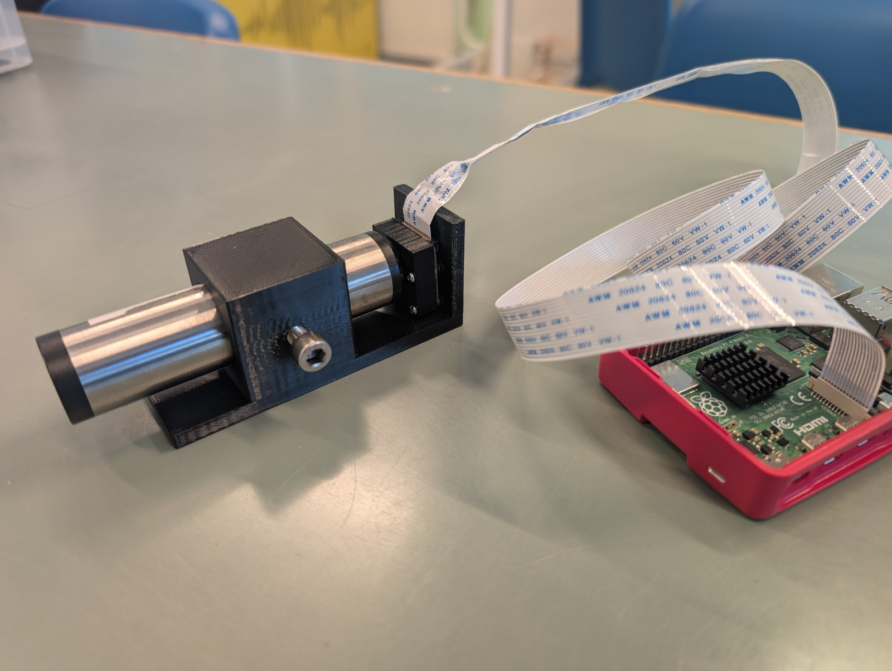

# Spectrometer met Camera
_deze handleiding is nog **under construction**_
practicumhandleiding

## Inleiding
Dit is de handleiding om een camera in te zetten om een spectrum te analyseren. Het spectrum wordt verkregen door middel van een standaard hand-spectroscoop, met daarin een spleet en tralie verwerkt. Eerst wordt de camera output gekalibreerd van pixels naar golflengte met een bekend sample, vervolgens kunnen allerlei spectra onderzocht worden. 

## Doel
Het zelf kalibreren en gebruiken van een op een camera gebaseerde spectrometer, om zodoende:
* Spectra te onderzoeken
* Werking van een spectroscoop te doorgronden
* Leren werken met en het belang inzien van kalibratie.

## Theorie
Met een spectrometer kan de golflengte worden gevonden die wordt
uitgezonden bij het terugvallen van een elektron naar lager
energieniveau.
Hiermee kan het emissiespectrum van gassen of het absorptiespectrum van
vloeistoffen worden geanalyseerd. Ook kan hier bijvoorbeeld het
noorderlicht mee worden onderzocht.
Een typische spectroscoop bestaat uit een spleet en een tralie. 
Door het spectrum op een camerasensor te laten vallen, kan het spectrum worden geanalyseerd. 
Daartoe moeten eerst de camera pixels, (in de richting van het spectrum - horizontaal), gekoppeld worden aan de juiste golflengte in *nm*: De camera moet gekalibreerd worden met een bekend spectrum. Bekende spectraallijnen (golflengtes) van het bekende spectrum worden gekoppeld aan de desbetreffende pixel waar deze spectraallijnen zichtbaar zijn. Een gekalibreerde camera kan ingezet worden om allerlei spectra te onderzoeken.

## Materiaal
In dit experiment wordt gebruik gemaakt van een hand-spectroscoop (25 mm diameter, 105 mm lang), met daarin een spleet en een tralie van 600 lijnen/mm. Het beeld van de spectroscoop wordt vastgelegd met een Raspberry Pi Camera 3 NoIR. Dit is een autofocus camera zonder infraroodfilter. Zodoende kunnen ook spectraallijnen die voor ons oog niet zichtbaar zijn worden weergegeven. De camera en spectroscoop zijn beide gemonteerd in een 3D geprinte houder om te zorgen dat er een stabiele fysieke verbinding is tussen de spectroscoop en de camera. 
De camera is via een lintkabel aangesloten op een Raspberry Pi. Deze mini computer heeft zijn eigen software (Raspbian), toetsenbord en scherm. 
Qua software wordt gebruik gemaakt van een camera script (Pycam) om de beelden op te slaan. 
Vervolgens worden de beelden met ImageJ geanalyseerd. 
Het data (.csv) bestand wordt met behulp van een USB stick op een computer gezet met een Spreadsheets programma (Excel). Hierin wordt de data verder verwerkt. 
> **Materiaalijst:**
> * hand-spectroscoop
> * Raspberry Pi Camera 3 NoIR (Bij andere camera's kan het handmatig scherpstellen met een (zoom)lens nodig zijn) 
> * Lintkabel (lang)
> * Raspberry Pi Model 4, met randapparatuur
> * Pycam camera software
> * ImageJ software
> * Excel software

 

## Uitvoering
1) Schakel de lamphouder met daarin de He buis in en laat deze even opwarmen.
2) Schakel de Raspberry Pi aan door de stekker van 5V voeding in het stopcontact te steken.
3) Open een **Terminal** door bovenaan op het zwarte vlakje te drukken.
4) Er opent een window met daarin een prompt. 
5) Type: .. (of druk op pijltje omhoog en zoek dit commando), druk nog niet op *Enter*.
6) Houd de spectroscoop met camera stil voor het gat van de lamphouder met daarin de He buis. 
7) Druk op *Enter* in het het terminal window. Er wordt nu een foto gemaakt, er zijn een paar previews, dus houd 'm even stil.
8) Bekijk de foto met de *Imageviewer*, als deze niet goed is kun je een nieuwe foto maken (ga dan terug naar 5, je kunt de naam van het bestand aanpassen).
9) Open de foto met **ImageJ**, door eerst ImageJ te openen en vervolgens te kiezen voor *open* en het bestand op de Desktop te openen.
10) Klik op de rechthoek *(Rectangle)*
11) Sleep van helemaal links naar helemaal rechts een dunne balk over het scherm, over het spectrum heen. 
12) Klik vervolgens op *Analyze* en daarna op *Plot Profile*.
13) Er opent zich een nieuw window met daarin de Grey Values uitgezet tegen de pixels. Hier kun je het spectrum in zien.
14) Klik onderaan *Data* en kies voor *Save Data*. Geef het bestand een treffende naam of kies voor het default en sla deze op, op de Desktop. 
15) Kopieer nu met ee USB-stick het bestand naar een computer met Excel. 
16) Open Excel op deze computer (Open het bestand niet, want dat gaat fout). Open een lege werkmap.
17) Kies voor *Gegevens* en *Gegevens ophalen*, *Uit bestand*, *Uit tekstbestand/CSV* en open je bestand.
 

18) Selecteer de twee kolommen en kies voor *Invoegen*, *Grafieken*, *Spreiding* (de eerste keuze).
19) In de grafiek die je nu hebt gemaakt staat verticaal de Grey Value uitgezet tegen horizontaal het pixelnummer.
20) De linker piek is onzin, dat is ook zichtbaar in de hand-spectroscoop, wanneer je deze zelf bekijkt met je ook. De andere pieken zijn de spectraallijnen van Helium met de grootste intensiteit.
21) Vergelijk het spectrum met dat van Helium in BiNaS, Tabel 20 (Spectraalplaat). De lijn/ piek met de grootste intensiteit heeft een golflengte van 588 nm (oranje-achtig). Andere goed zichtbare (de hoogste) pieken zouden moeten zijn: 501 nm, 668 nm, 706 nm.
22) Door op een top van een piek te klikken en de muis er vanaf en er naar toe te bewegen kun je de precieze coördinaten aflezen. Het pixelnummer willen we namelijk weten. Je kunt controleren of je echt de top hebt door in de data te kijken of dit punt echt het plaatselijke maximum is.
23) Koppel het pixelnummer en de bijbehorende golflengte aan elkaar in een tabelletje in hetzelfde werkblad. Zoiets:

  
|pixel|wavelength (nm)|
|---|---|
|2457|	588|
  

24) Doe dit voor alle 4 de genoemde golflengtes hierboven.
25) Selecteer deze tabel, klik op invoegen, grafiek, spreiding. 
26) Selecteer een meetpunt in de grafiek, rechtermuisknop, trendlijn toevoegen. 
27) Kies lineaire trendlijn en vink vergelijking in grafiek weergeven toe. 
28) Kopieer de functie van de trendlijn of neem deze over. 
29) Voeg een kolom toe, tussen kolom A en B in. Dit wordt de nieuwe B. 
30) Verander de kop van deze kolom in *Golflengte (nm)* en voeg in cel B2 de functie van de trendlijn toe, waarbij $x$ veranderd wordt in $*A2$. 
31) Laat de kolom automatisch vullen tot het einde.
32) Maak nu een nieuwe spreiding grafiek van kolom B en kolom C: Je hebt nu de gekalibreerde gegevens!

